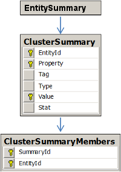

# ClusterSummary Tables #

The ClusterSummary tables summarize entities with a large number of associated entities (e.g., an account owner with a large number of accounts). While the **DataViewTables** scripts in [*influent-spi/src/main/dataviews/*](https://github.com/unchartedsoftware/influent/tree/master/influent-spi/src/main/dataviews) will create the ClusterSummary tables, you must choose whether to populate them. 

- [ClusterSummary](#clustersummary)
- [ClusterSummaryMembers](#clustersummarymembers)

For information on adding aggregate entity groups to your data to simplify the user experience and optimize application performance, see the following section. The size of your data will help determine what cluster summaries to generate.

For a diagram illustrating how the ClusterSummary tables relate to other Influent tables, see the [Entity Relationships](#entity-relationships) section.

## Account Owner and Cluster Summary Records ##

While the records in your Transaction Flow tables are automatically generated using the information in your source database, you may choose to add additional records to the tables if your source data contains large groups of related entities. Aggregating the following types of entity groups can simplify the user experience and optimize application performance:

- Large groups of accounts owned by the same entity
- Large groups of accounts that branch off a single entity (e.g., if one entity has sent 100K transactions, you may want to create a single, clustered summary of the 100K recipients so they can be easily loaded in the transaction flow view)

**NOTE**: Aggregation of large entity groups into clusters is a custom process that must be specifically defined and coded for each Influent application. For the example applications, large entity groups are defined as those containing more than 1,000 related entities. Your implementation may vary depending on your source data and machine resources.

There are two types of records that can be inserted into the Transaction Flow tables to summarize these types of clusters:

1. **Account Owner Records**, which represent an aggregation of child entities owned by the same actor. Account owner records have an entity type (to or from) of *O*. They also require you to provide a link to the Account Owner's records in the [Cluster Summary](#cluster-summary) tables.
2. **Cluster Summary Records**, which represent an aggregation of a group of entities. Cluster summary records have an entity type (to or from) of *S*.

## ClusterSummary ##

The ClusterSummary table stores the properties (labels, entity attributes, branching permissions) of all the cluster summary and account owner entities in your data. Each cluster should have multiple entries in this table, each of which stores a different property.

All properties should be mapped to an FL_PropertyTag. For complete details of the available PropertyTags, see the **DataEnums\_vX.X.avdl** file in [influent-spi/src/main/avro/](https://github.com/unchartedsoftware/influent/tree/master/influent-spi/src/main/avro).

At a minimum, each entry should have entries for the following properties:

- *Child Entity Count*: Total number of entities that belong to the group.
- *Owner ID*: The ID of the entity that owns the group of child entities.
- *Account Type*: Dataset-specific account type.
- *Label*: Name of the group.

Additional properties should be stored for any summary distribution icons you have enabled for entity displays in the Influent Flow view.

To view example ClusterSummary entries, see the [Example Records](#example-records) section after the description of the table columns.

	<table class="summaryTable">
		<thead>
			<tr>
				<th scope="col">Column</th>
				<th scope="col">Data Type</th>
				<th scope="col">Nullable?</th>
				<th scope="col">Description</th>
			</tr>
		</thead>
		<tbody>
			<tr>
				<td class="property">EntityId</td>
				<td class="value">varchar(100)</td>
				<td class="description">Yes</td>
				<td class="description">Unique identifier of the cluster entity.</td>
			</tr>
			<tr>
				<td class="property">Property</td>
				<td class="value">varchar(50)</td>
				<td class="description">Yes</td>
				<td class="description">Name of summary property, which corresponds to an entity attribute (e.g., label or summary icon) that can be displayed on the stack that represents the account owner or cluster summary in the Influent Flow view.</td>
			</tr>
			<tr>
				<td class="property">Tag</td>
				<td class="value">varchar(50)</td>
				<td class="description">Yes</td>
				<td class="description">Tag associated with the corresponding property expressed as an FL_PropertyTag.   For complete details of the available PropertyTags, see the <strong>DataEnums_vX.X.avdl</strong> file in <a href="https://github.com/unchartedsoftware/influent/tree/master/influent-spi/src/main/avro"><em>influent-spi/src/main/avro/</em></a>.</td>
			</tr>
			<tr>
				<td class="property">Type</td>
				<td class="value">varchar(50)</td>
				<td class="description">Yes</td>
				<td class="description">Data type of the corresponding property expressed as an FL_PropertyType: <em>FLOAT</em>, <em>DOUBLE</em>, <em>INTEGER</em>, <em>LONG</em>, <em>BOOLEAN</em>, <em>STRING</em>, <em>DATE</em> or <em>GEO</em>.
				  For complete details of the available DataEnums, see the <strong>DataEnums_vX.X.avdl</strong> file in <a href="https://github.com/unchartedsoftware/influent/tree/master/influent-spi/src/main/avro"><em>influent-spi/src/main/avro/</em></a>.
				</td>
			</tr>
			<tr>
				<td class="property">Value</td>
				<td class="value">varchar(200)</td>
				<td class="description">Yes</td>
				<td class="description">String representation of the property value</td>
			</tr>
			<tr>
				<td class="property">Stat</td>
				<td class="value">float</td>
				<td class="description">Yes</td>
				<td class="description">Associated stat for the property value such as frequency or weight</td>
			</tr>
		</tbody>
	</table>

###  Example Records ###

The following examples illustrate how to create records for [account owners](#account-owners) and [unbranchable clusters](#unbranchable-clusters).

####  Account Owners ####

Account owners should have a record with an *ownerId* property that associates the entity ID of the account owner to the record. In the following example, the *s.partner.p10* entity is the owner of the accounts that belong to *sp10*:

	<table class="summaryTable">
		<thead>
			<tr>
				<th scope="col">EntityId</th>
				<th scope="col">Property</th>
				<th scope="col">Tag</th>
				<th scope="col">Type</th>
				<th scope="col">Value</th>
				<th scope="col">Stat</th>
			</tr>
		</thead>
		<tbody>
			<tr>
				<td class="value">sp10</td>
				<td class="value">ownerId</td>
				<td class="value">ACCOUNT_OWNER</td>
				<td class="value">STRING</td>
				<td class="value">s.partner.p10</td>
				<td class="value">0</td>
			</tr>
		</tbody>
	</table>

####  Unbranchable Clusters ####

Cluster summaries that do not support branching should have a record with an *UNBRANCHABLE* property. By default, all other records are considered are branchable.

	<table class="summaryTable">
		<thead>
			<tr>
				<th scope="col">EntityId</th>
				<th scope="col">Property</th>
				<th scope="col">Tag</th>
				<th scope="col">Type</th>
				<th scope="col">Value</th>
				<th scope="col">Stat</th>
			</tr>
		</thead>
		<tbody>
			<tr>
				<td class="value">sl10</td>
				<td class="value">UNBRANCHABLE</td>
				<td class="value">ENTITY_TYPE</td>
				<td class="value">BOOLEAN</td>
				<td class="value">true</td>
				<td class="value">0</td>
			</tr>
		</tbody>
	</table>

## ClusterSummaryMembers ##

The ClusterSummaryMembers table stores a list of entities that belong to each account owner or cluster summary. It is up to each application to determine what cluster summaries to generate based on the size of data.

	<table class="summaryTable">
		<thead>
			<tr>
				<th scope="col">Column</th>
				<th scope="col">Data Type</th>
				<th scope="col">Nullable?</th>
				<th scope="col">Description</th>
			</tr>
		</thead>
		<tbody>
			<tr>
				<td class="property">SummaryId</td>
				<td class="value">varchar(100)</td>
				<td class="description">Yes</td>
				<td class="description">Unique identifier of the cluster entity.</td>
			</tr>
			<tr>
				<td class="property">EntityId</td>
				<td class="value">varchar(100)</td>
				<td class="description">Yes</td>
				<td class="description">Unique identifier of an individual entity that belongs to the corresponding cluster entity.</td>
			</tr>
		</tbody>
	</table>

##  Entity Relationships ##

The following entity relationship diagram illustrates the order in which the ClusterSummary tables are built using the information in your source dataset. As each table is essentially a summary of your original data, each table is linked to every other table through the unique entity IDs in your dataset.

