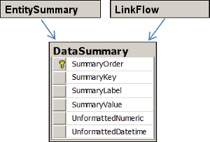

# DataSummary Table #

The DataSummary table contains overview statistics that describe your transaction data. These statistics appear on the Influent Summary view.

For a diagram illustrating how the DataSummary table relates to other Influent tables, see the [Entity Relationships](#entity-relationships) section.

##  DataSummary ##

While this table can be modified for your application, by default the following records are calculated from the information inserted into [EntitySummary](../entity/#entitysummary) and [LinkFlow](../linkflow/#linkflow):
 
1. **About**: A short description of the dataset used to create your Influent application. Must be entered manually. Supports HTML encoding.
2. **Account**: Total number of unique accounts in your dataset.
3. **Transactions**: Total number of transactions in your dataset.
4. **Earliest Transaction**: Oldest transaction in your dataset.
5. **Latest Transaction**: Most recent transaction in your dataset.

	<table class="summaryTable">
		<thead>
			<tr>
				<th scope="col">Column</th>
				<th scope="col">Data Type</th>
				<th scope="col">Nullable?</th>
				<th scope="col">Description</th>
			</tr>
		</thead>
		<tbody>
			<tr>
				<td class="property">SummaryOrder</td>
				<td class="value">int</td>
				<td class="description">No</td>
				<td class="description">Indicates the order in which records should be displayed on the Influent Summary view. Should start at 1 and increment for each subsequent record.</td>
			</tr>
			<tr>
				<td class="property">SummaryKey</td>
				<td class="value">varchar(100)</td>
				<td class="description">No</td>
				<td class="description">Short summary field label.</td>
			</tr>
			<tr>
				<td class="property">SummaryLabel</td>
				<td class="value">varchar(1000)</td>
				<td class="description">Yes</td>
				<td class="description">Expanded summary field label. Appears in the user interface.</td>
			</tr>
			<tr>
				<td class="property">SummaryValue</td>
				<td class="value">text</td>
				<td class="description">Yes</td>
				<td class="description">Value of the summary field. Supports HTML encoding.</td>
			</tr>
			<tr>
				<td class="property">UnformattedNumeric</td>
				<td class="value">float</td>
				<td class="description">Yes</td>
				<td class="description">Serves as a reference for numeric fields in the event that the SummaryValue becomes corrupted or loses valuable information.</td>
			</tr>
			<tr>
				<td class="property">UnformattedDatetime</td>
				<td class="value">datetime</td>
				<td class="description">Yes</td>
				<td class="description">Serves as a reference for datetime fields in the event that the SummaryValue becomes corrupted or loses valuable information.</td>
			</tr>
		</tbody>
	</table>

##  Entity Relationships ##

The following entity relationship diagram illustrates the order in which the DataSummary table is built using the information in your source dataset. As each table is essentially a summary of your original data, each table is linked to every other table through the unique entity IDs in your dataset.

