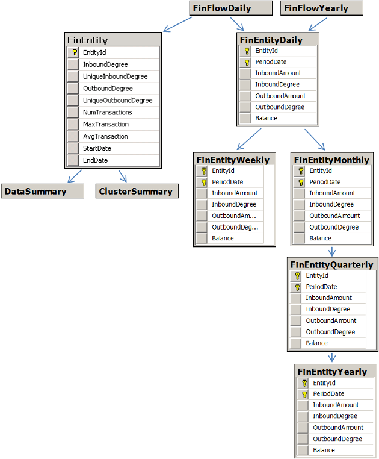

# FinEntity Tables #

The FinEntity tables describe all of the entities in your dataset. Entities are stored in six different tables, each of which has a different time-based aggregation scheme.

- [FinEntity](#finentity)
- [FinEntityDaily](#finentitydaily)
- [FinEntityWeekly](#finentityweekly)
- [FinEntityMonthly](#finentitymonthly)
- [FinEntityQuarterly](#finentityquarterly)
- [FinEntityYearly](#finentityyearly)

For a diagram illustrating how the FinEntity tables relate to other Influent tables, see the [Entity Relationships](#entity-relationships) section.

## FinEntity ##

Each record in the FinEntity table represents a unique entity in your transaction data. Records are calculated from the information inserted into [FinFlowDaily](../finflow/#finflowdaily).

	<table class="summaryTable">
		<thead>
			<tr>
				<th scope="col">Column</th>
				<th scope="col">Data Type</th>
				<th scope="col">Nullable?</th>
				<th scope="col">Description</th>
			</tr>
		</thead>
		<tbody>
			<tr>
				<td class="property">EntityId</td>
				<td class="value">varchar(100)</td>
				<td class="description">Yes</td>
				<td class="description">Unique entity identifier.</td>
			</tr>
			<tr>
				<td class="property">InboundDegree</td>
				<td class="value">int</td>
				<td class="description">Yes</td>
				<td class="description">Total number of transactions received by the corresponding entity.</td>
			</tr>
			<tr>
				<td class="property">UniqueInboundDegree</td>
				<td class="value">int</td>
				<td class="description">Yes</td>
				<td class="description">Total number of <em>unique</em> entities from which the corresponding entity received transactions.</td>
			</tr>
			<tr>
				<td class="property">OutboundDegree</td>
				<td class="value">int</td>
				<td class="description">Yes</td>
				<td class="description">Total number of transactions sent by the corresponding entity.</td>
			</tr>
			<tr>
				<td class="property">UniqueOutboundDegree</td>
				<td class="value">int</td>
				<td class="description">Yes</td>
				<td class="description">Total number of <em>unique</em> entities to which the corresponding entity sent transactions.</td>
			</tr>
			<tr>
				<td class="property">NumTransactions</td>
				<td class="value">int</td>
				<td class="description">Yes</td>
				<td class="description">Total number of transactions involving the corresponding entity.</td>
			</tr>
			<tr>
				<td class="property">StartDate</td>
				<td class="value">datetime</td>
				<td class="description">Yes</td>
				<td class="description">First date on which the corresponding entity sent or received a transaction.</td>
			</tr>
			<tr>
				<td class="property">EndDate</td>
				<td class="value">datetime</td>
				<td class="description">Yes</td>
				<td class="description">Most recent date on which the corresponding entity sent or received a transaction.</td>
			</tr>
			<tr>
				<td class="property">MaxTransaction</td>
				<td class="value">float</td>
				<td class="description">Yes</td>
				<td class="description">Value of the largest transaction in which the corresponding entity participated.</td>
			</tr>
			<tr>
				<td class="property">AvgTransaction</td>
				<td class="value">float</td>
				<td class="description">Yes</td>
				<td class="description">Average value of all the transactions in which the corresponding entity participated.</td>
			</tr>
		</tbody>
	</table>

	
## FinEntityDaily ##

Each record in the FinEntityDaily table represents all of the transactions involving a unique entity on a single day. Records are calculated from the information inserted into [FinFlowYearly](../finflow/#finflowmonthly) and [FinFlowDaily](../finflow/#finflowdaily).

	<table class="summaryTable">
		<thead>
			<tr>
				<th scope="col">Column</th>
				<th scope="col">Data Type</th>
				<th scope="col">Nullable?</th>
				<th scope="col">Description</th>
			</tr>
		</thead>
		<tbody>
			<tr>
				<td class="property">EntityId</td>
				<td class="value">varchar(100)</td>
				<td class="description">Yes</td>
				<td class="description">Unique entity identifier.</td>
			</tr>
			<tr>
				<td class="property">PeriodDate</td>
				<td class="value">datetime</td>
				<td class="description">Yes</td>
				<td class="description">Date (YYYY-MM-DD hh:mm:ss.fff) on which the transactions were executed.</td>
			</tr>
			<tr>
				<td class="property">InboundAmount</td>
				<td class="value">float</td>
				<td class="description">Yes</td>
				<td class="description">Aggregate value of the transactions received by the entity on the corresponding day.</td>
			</tr>
			<tr>
				<td class="property">InboundDegree</td>
				<td class="value">int</td>
				<td class="description">Yes</td>
				<td class="description">Total number of transactions received by the entity on the corresponding day.</td>
			</tr>
			<tr>
				<td class="property">OutboundAmount</td>
				<td class="value">float</td>
				<td class="description">Yes</td>
				<td class="description">Aggregate value of the transactions sent by the entity on the corresponding day.</td>
			</tr>
			<tr>
				<td class="property">OutboundDegree</td>
				<td class="value">int</td>
				<td class="description">Yes</td>
				<td class="description">Total number of transactions sent by the entity on the corresponding day.</td>
			</tr>
			<tr>
				<td class="property">Balance</td>
				<td class="value">float</td>
				<td class="description">Yes</td>
				<td class="description">Reserved for future use.</td>
			</tr>
		</tbody>
	</table>

## FinEntityWeekly ##

Each record in the FinEntityWeekly table represents all of the transactions involving a unique entity in a single week (each of which starts on a Sunday). Records are calculated from the information inserted into [FinEntityDaily](#finentitydaily).

	<table class="summaryTable">
		<thead>
			<tr>
				<th scope="col">Column</th>
				<th scope="col">Data Type</th>
				<th scope="col">Nullable?</th>
				<th scope="col">Description</th>
			</tr>
		</thead>
		<tbody>
			<tr>
				<td class="property">EntityId</td>
				<td class="value">varchar(100)</td>
				<td class="description">Yes</td>
				<td class="description">Unique entity identifier.</td>
			</tr>
			<tr>
				<td class="property">PeriodDate</td>
				<td class="value">datetime</td>
				<td class="description">Yes</td>
				<td class="description">First date (YYYY-MM-DD hh:mm:ss.fff) in the month over which the transactions were executed. Always corresponds to the first of the month.</td>
			</tr>
			<tr>
				<td class="property">InboundAmount</td>
				<td class="value">float</td>
				<td class="description">Yes</td>
				<td class="description">Aggregate value of the transactions received by the entity in the corresponding week.</td>
			</tr>
			<tr>
				<td class="property">InboundDegree</td>
				<td class="value">int</td>
				<td class="description">Yes</td>
				<td class="description">Total number of transactions received by the entity in the corresponding week.</td>
			</tr>
			<tr>
				<td class="property">OutboundAmount</td>
				<td class="value">float</td>
				<td class="description">Yes</td>
				<td class="description">Aggregate value of the transactions sent by the entity in the corresponding week.</td>
			</tr>
			<tr>
				<td class="property">OutboundDegree</td>
				<td class="value">int</td>
				<td class="description">Yes</td>
				<td class="description">Total number of transactions sent by the entity in the corresponding week.</td>
			</tr>
			<tr>
				<td class="property">Balance</td>
				<td class="value">float</td>
				<td class="description">Yes</td>
				<td class="description">Reserved for future use.</td>
			</tr>
		</tbody>
	</table>

## FinEntityMonthly ##

Each record in the FinEntityMonthly table represents all of the transactions involving a unique entity in a single calendar month. Records are calculated from the information inserted into [FinEntityDaily](#finentitydaily).

	<table class="summaryTable">
		<thead>
			<tr>
				<th scope="col">Column</th>
				<th scope="col">Data Type</th>
				<th scope="col">Nullable?</th>
				<th scope="col">Description</th>
			</tr>
		</thead>
		<tbody>
			<tr>
				<td class="property">EntityId</td>
				<td class="value">varchar(100)</td>
				<td class="description">Yes</td>
				<td class="description">Unique entity identifier.</td>
			</tr>
			<tr>
				<td class="property">PeriodDate</td>
				<td class="value">datetime</td>
				<td class="description">Yes</td>
				<td class="description">First date (YYYY-MM-DD hh:mm:ss.fff) in the month over which the transactions were executed. Always corresponds to the first of the month.</td>
			</tr>
			<tr>
				<td class="property">InboundAmount</td>
				<td class="value">float</td>
				<td class="description">Yes</td>
				<td class="description">Aggregate value of the transactions received by the entity in the corresponding month.</td>
			</tr>
			<tr>
				<td class="property">InboundDegree</td>
				<td class="value">int</td>
				<td class="description">Yes</td>
				<td class="description">Total number of transactions received by the entity in the corresponding month.</td>
			</tr>
			<tr>
				<td class="property">OutboundAmount</td>
				<td class="value">float</td>
				<td class="description">Yes</td>
				<td class="description">Aggregate value of the transactions sent by the entity in the corresponding month.</td>
			</tr>
			<tr>
				<td class="property">OutboundDegree</td>
				<td class="value">int</td>
				<td class="description">Yes</td>
				<td class="description">Total number of transactions sent by the entity in the corresponding month.</td>
			</tr>
			<tr>
				<td class="property">Balance</td>
				<td class="value">float</td>
				<td class="description">Yes</td>
				<td class="description">Reserved for future use.</td>
			</tr>
		</tbody>
	</table>

## FinEntityQuarterly ##

Each record in the FinEntityQuarterly table represents all of the transactions involving a unique entity in a single quarter, where:

- Q1 = Jan 1 - Mar 31
- Q2 = Apr 1 - Jun 30
- Q3 = Jul 1 - Sep 30
- Q4 = Oct 1 - Dec 31

Records are calculated from the information inserted into [FinEntityMonthly](#finentitymonthly).

	<table class="summaryTable">
		<thead>
			<tr>
				<th scope="col">Column</th>
				<th scope="col">Data Type</th>
				<th scope="col">Nullable?</th>
				<th scope="col">Description</th>
			</tr>
		</thead>
		<tbody>
			<tr>
				<td class="property">EntityId</td>
				<td class="value">varchar(100)</td>
				<td class="description">Yes</td>
				<td class="description">Unique entity identifier.</td>
			</tr>
			<tr>
				<td class="property">PeriodDate</td>
				<td class="value">datetime</td>
				<td class="description">Yes</td>
				<td class="description">First date (YYYY-MM-DD hh:mm:ss.fff) in the quarter over which the transactions were executed. Always corresponds to Jan 1, Apr 1, Jul 1 or Oct 1.</td>
			</tr>
			<tr>
				<td class="property">InboundAmount</td>
				<td class="value">float</td>
				<td class="description">Yes</td>
				<td class="description">Aggregate value of the transactions received by the entity in the corresponding quarter.</td>
			</tr>
			<tr>
				<td class="property">InboundDegree</td>
				<td class="value">int</td>
				<td class="description">Yes</td>
				<td class="description">Total number of transactions received by the entity in the corresponding quarter.</td>
			</tr>
			<tr>
				<td class="property">OutboundAmount</td>
				<td class="value">float</td>
				<td class="description">Yes</td>
				<td class="description">Aggregate value of the transactions sent by the entity in the corresponding quarter.</td>
			</tr>
			<tr>
				<td class="property">OutboundDegree</td>
				<td class="value">int</td>
				<td class="description">Yes</td>
				<td class="description">Total number of transactions sent by the entity in the corresponding quarter.</td>
			</tr>
			<tr>
				<td class="property">Balance</td>
				<td class="value">float</td>
				<td class="description">Yes</td>
				<td class="description">Reserved for future use.</td>
			</tr>
		</tbody>
	</table>

## FinEntityYearly ##

Each record in the FinEntityYearly table represents all of the transactions involving a unique entity in a single calendar year. Records are calculated from the information inserted into [FinEntityQuarterly](#finentityquarterly).

	<table class="summaryTable">
		<thead>
			<tr>
				<th scope="col">Column</th>
				<th scope="col">Data Type</th>
				<th scope="col">Nullable?</th>
				<th scope="col">Description</th>
			</tr>
		</thead>
		<tbody>
			<tr>
				<td class="property">EntityId</td>
				<td class="value">varchar(100)</td>
				<td class="description">Yes</td>
				<td class="description">Unique entity identifier.</td>
			</tr>
			<tr>
				<td class="property">PeriodDate</td>
				<td class="value">datetime</td>
				<td class="description">Yes</td>
				<td class="description">First date (YYYY-MM-DD hh:mm:ss.fff) in the year over which the transactions were executed. Always corresponds to Jan 1.</td>
			</tr>
			<tr>
				<td class="property">InboundAmount</td>
				<td class="value">float</td>
				<td class="description">Yes</td>
				<td class="description">Aggregate value of the transactions received by the entity in the corresponding year.</td>
			</tr>
			<tr>
				<td class="property">InboundDegree</td>
				<td class="value">int</td>
				<td class="description">Yes</td>
				<td class="description">Total number of transactions received by the entity in the corresponding year.</td>
			</tr>
			<tr>
				<td class="property">OutboundAmount</td>
				<td class="value">float</td>
				<td class="description">Yes</td>
				<td class="description">Aggregate value of the transactions sent by the entity in the corresponding year.</td>
			</tr>
			<tr>
				<td class="property">OutboundDegree</td>
				<td class="value">int</td>
				<td class="description">Yes</td>
				<td class="description">Total number of transactions sent by the entity in the corresponding year.</td>
			</tr>
			<tr>
				<td class="property">Balance</td>
				<td class="value">float</td>
				<td class="description">Yes</td>
				<td class="description">Reserved for future use.</td>
			</tr>
		</tbody>
	</table>

##  Entity Relationships ##

The following entity relationship diagram illustrates the order in which the FinEntity tables are built using the information in your source dataset. As each table is essentially a summary of your original data, each table is linked to every other table through the unique entity IDs in your dataset.

