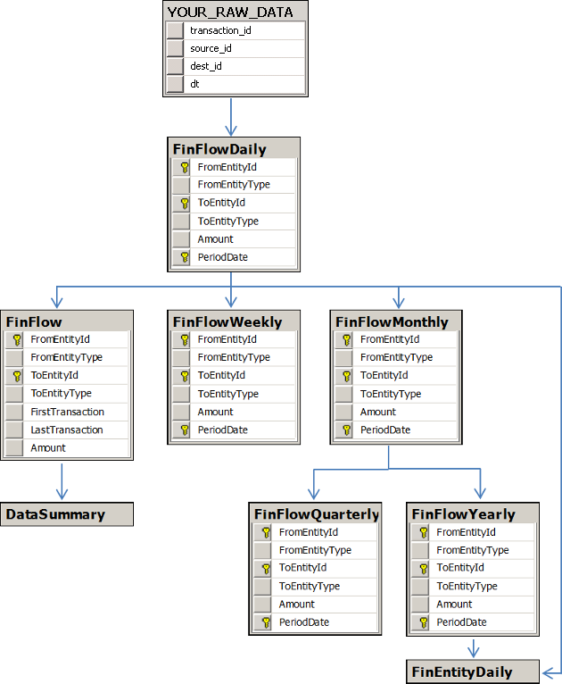

# FinFlow Tables #

The FinFlow tables describe all of the transactions in your dataset, with each record representing one or more transactions between a specific source and destination entity. There are six different Transaction Flow tables, each of which has a different time-based aggregation scheme:

- [FinFlow](#finflow)
- [FinFlowDaily](#finflowdaily)
- [FinFlowWeekly](#finflowweekly)
- [FinFlowMonthly](#finflowmonthly)
- [FinFlowQuarterly](#finflowquarterly)
- [FinFlowYearly](#finflowyearly)

For a diagram illustrating how the FinFlow tables relate to your raw data source and the other Influent tables, see the [Entity Relationships](#entity-relationships) section.

## FinFlow ##

Each record in the FinFlow table represents an aggregation of all transactions between a source and destination entity. Records are calculated from the information inserted into [FinFlowDaily](#finflowdaily).

	<table class="summaryTable">
		<thead>
			<tr>
				<th scope="col">Column</th>
				<th scope="col">Data Type</th>
				<th scope="col">Nullable?</th>
				<th scope="col">Description</th>
			</tr>
		</thead>
		<tbody>
			<tr>
				<td class="property">FromEntityId</td>
				<td class="value">varchar(100)</td>
				<td class="description">No</td>
				<td class="description">Unique identifier of the entity that sent the transaction.</td>
			</tr>
			<tr>
				<td class="property">FromEntityType</td>
				<td class="value">varchar(1)</td>
				<td class="description">Yes</td>
				<td class="description">Type of entity that sent the transaction: 
					<ul>
						<li><em>O</em> = Owner summary</li>
						<li><em>A</em> = Account</li>
						<li><em>S</em> = Cluster summary entity</li>
					</ul>
				</td>
			</tr>
			<tr>
				<td class="property">ToEntityId</td>
				<td class="value">varchar(100)</td>
				<td class="description">No</td>
				<td class="description">Unique identifier of the entity that received the transaction.</td>
			</tr>
			<tr>
				<td class="property">ToEntityType</td>
				<td class="value">varchar(1)</td>
				<td class="description">Yes</td>
				<td class="description">Type of entity that received the transaction:
					<ul>
						<li><em>O</em> = owner summary</li>
						<li><em>A</em> = account</li>
						<li><em>S</em> = cluster summary entity</li>
					</ul>
				</td>
			</tr>
			<tr>
				<td class="property">FirstTransaction</td>
				<td class="value">datetime</td>
				<td class="description">Yes</td>
				<td class="description">Date and time (YYYY-MM-DD hh:mm:ss.fff) at which the corresponding entities first participated in a transaction.</td>
			</tr>
			<tr>
				<td class="property">LastTransaction</td>
				<td class="value">datetime</td>
				<td class="description">Yes</td>
				<td class="description">Date and time at which the corresponding entities last participated in a transaction.</td>
			</tr>
			<tr>
				<td class="property">Amount</td>
				<td class="value">float</td>
				<td class="description">Yes</td>
				<td class="description">Aggregate value of the transactions between the entities.</td>
			</tr>
		</tbody>
	</table>

## FinFlowDaily ##

Each record in the FinFlowDaily table represents an aggregation of all transactions between a source and destination entity on a single day. Records are calculated directly from the information in your source database.

	<table class="summaryTable">
		<thead>
			<tr>
				<th scope="col">Column</th>
				<th scope="col">Data Type</th>
				<th scope="col">Nullable?</th>
				<th scope="col">Description</th>
			</tr>
		</thead>
		<tbody>
			<tr>
				<td class="property">FromEntityId</td>
				<td class="value">varchar(100)</td>
				<td class="description">No</td>
				<td class="description">Unique identifier of the entity that sent the transaction.</td>
			</tr>
			<tr>
				<td class="property">FromEntityType</td>
				<td class="value">varchar(1)</td>
				<td class="description">Yes</td>
				<td class="description">Type of entity that sent the transaction: 
					<ul>
						<li><em>O</em> = Owner summary</li>
						<li><em>A</em> = Account</li>
						<li><em>S</em> = Cluster summary entity</li>
					</ul>
				</td>
			</tr>
			<tr>
				<td class="property">ToEntityId</td>
				<td class="value">varchar(100)</td>
				<td class="description">No</td>
				<td class="description">Unique identifier of the entity that received the transaction.</td>
			</tr>
			<tr>
				<td class="property">ToEntityType</td>
				<td class="value">varchar(1)</td>
				<td class="description">Yes</td>
				<td class="description">Type of entity that received the transaction:
					<ul>
						<li><em>O</em> = owner summary</li>
						<li><em>A</em> = account</li>
						<li><em>S</em> = cluster summary entity</li>
					</ul>
				</td>
			</tr>
			<tr>
				<td class="property">Amount</td>
				<td class="value">float</td>
				<td class="description">Yes</td>
				<td class="description">Aggregate value of the transactions between the entities on the corresponding day.</td>
			</tr>
			<tr>
				<td class="property">PeriodDate</td>
				<td class="value">datetime</td>
				<td class="description">Yes</td>
				<td class="description">Date (YYYY-MM-DD hh:mm:ss.fff) on which the transactions were executed.</td>
			</tr>
		</tbody>
	</table>

## FinFlowWeekly ##

Each record in the FinFlowWeekly table represents an aggregation of all transactions between a source and destination entity in a single week (each of which starts on a Sunday). Records are calculated from the information inserted into [FinFlowDaily](#finflowdaily).

	<table class="summaryTable">
		<thead>
			<tr>
				<th scope="col">Column</th>
				<th scope="col">Data Type</th>
				<th scope="col">Nullable?</th>
				<th scope="col">Description</th>
			</tr>
		</thead>
		<tbody>
			<tr>
				<td class="property">FromEntityId</td>
				<td class="value">varchar(100)</td>
				<td class="description">No</td>
				<td class="description">Unique identifier of the entity that sent the transaction.</td>
			</tr>
			<tr>
				<td class="property">FromEntityType</td>
				<td class="value">varchar(1)</td>
				<td class="description">Yes</td>
				<td class="description">Type of entity that sent the transaction: 
					<ul>
						<li><em>O</em> = Owner summary</li>
						<li><em>A</em> = Account</li>
						<li><em>S</em> = Cluster summary entity</li>
					</ul>
				</td>
			</tr>
			<tr>
				<td class="property">ToEntityId</td>
				<td class="value">varchar(100)</td>
				<td class="description">No</td>
				<td class="description">Unique identifier of the entity that received the transaction.</td>
			</tr>
			<tr>
				<td class="property">ToEntityType</td>
				<td class="value">varchar(1)</td>
				<td class="description">Yes</td>
				<td class="description">Type of entity that received the transaction:
					<ul>
						<li><em>O</em> = owner summary</li>
						<li><em>A</em> = account</li>
						<li><em>S</em> = cluster summary entity</li>
					</ul>
				</td>
			</tr>
			<tr>
				<td class="property">Amount</td>
				<td class="value">float</td>
				<td class="description">Yes</td>
				<td class="description">Aggregate value of the transactions between the entities during the corresponding week.</td>
			</tr>
			<tr>
				<td class="property">PeriodDate</td>
				<td class="value">datetime</td>
				<td class="description">Yes</td>
				<td class="description">First date (YYYY-MM-DD hh:mm:ss.fff) in the week over which the transactions were executed. Always corresponds to a Sunday.</td>
			</tr>
		</tbody>
	</table>

## FinFlowMonthly ##

Each record in the FinFlowMonthly table represents an aggregation of all transactions between a source and destination entity in a single calendar month. Records are calculated from the information inserted into [FinFlowDaily](#finflowdaily).

	<table class="summaryTable">
		<thead>
			<tr>
				<th scope="col">Column</th>
				<th scope="col">Data Type</th>
				<th scope="col">Nullable?</th>
				<th scope="col">Description</th>
			</tr>
		</thead>
		<tbody>
			<tr>
				<td class="property">FromEntityId</td>
				<td class="value">varchar(100)</td>
				<td class="description">No</td>
				<td class="description">Unique identifier of the entity that sent the transaction.</td>
			</tr>
			<tr>
				<td class="property">FromEntityType</td>
				<td class="value">varchar(1)</td>
				<td class="description">Yes</td>
				<td class="description">Type of entity that sent the transaction: 
					<ul>
						<li><em>O</em> = Owner summary</li>
						<li><em>A</em> = Account</li>
						<li><em>S</em> = Cluster summary entity</li>
					</ul>
				</td>
			</tr>
			<tr>
				<td class="property">ToEntityId</td>
				<td class="value">varchar(100)</td>
				<td class="description">No</td>
				<td class="description">Unique identifier of the entity that received the transaction.</td>
			</tr>
			<tr>
				<td class="property">ToEntityType</td>
				<td class="value">varchar(1)</td>
				<td class="description">Yes</td>
				<td class="description">Type of entity that received the transaction:
					<ul>
						<li><em>O</em> = owner summary</li>
						<li><em>A</em> = account</li>
						<li><em>S</em> = cluster summary entity</li>
					</ul>
				</td>
			</tr>
			<tr>
				<td class="property">Amount</td>
				<td class="value">float</td>
				<td class="description">Yes</td>
				<td class="description">Aggregate value of the transactions between the entities during the corresponding month.</td>
			</tr>
			<tr>
				<td class="property">PeriodDate</td>
				<td class="value">datetime</td>
				<td class="description">Yes</td>
				<td class="description">First date (YYYY-MM-DD hh:mm:ss.fff) in the month over which the transactions were executed. Always corresponds to the first of the month.</td>
			</tr>
		</tbody>
	</table>

## FinFlowQuarterly ##

Each record in the FinFlowQuarterly table represents an aggregation of all transactions between a source and destination entity in a single quarter, where:

- Q1 = Jan 1 - Mar 31
- Q2 = Apr 1 - Jun 30
- Q3 = Jul 1 - Sep 30
- Q4 = Oct 1 - Dec 31

Records are calculated from the information inserted into [FinFlowMonthly](#finflowmonthly).

	<table class="summaryTable">
		<thead>
			<tr>
				<th scope="col">Column</th>
				<th scope="col">Data Type</th>
				<th scope="col">Nullable?</th>
				<th scope="col">Description</th>
			</tr>
		</thead>
		<tbody>
			<tr>
				<td class="property">FromEntityId</td>
				<td class="value">varchar(100)</td>
				<td class="description">No</td>
				<td class="description">Unique identifier of the entity that sent the transaction.</td>
			</tr>
			<tr>
				<td class="property">FromEntityType</td>
				<td class="value">varchar(1)</td>
				<td class="description">Yes</td>
				<td class="description">Type of entity that sent the transaction: 
					<ul>
						<li><em>O</em> = Owner summary</li>
						<li><em>A</em> = Account</li>
						<li><em>S</em> = Cluster summary entity</li>
					</ul>
				</td>
			</tr>
			<tr>
				<td class="property">ToEntityId</td>
				<td class="value">varchar(100)</td>
				<td class="description">No</td>
				<td class="description">Unique identifier of the entity that received the transaction.</td>
			</tr>
			<tr>
				<td class="property">ToEntityType</td>
				<td class="value">varchar(1)</td>
				<td class="description">Yes</td>
				<td class="description">Type of entity that received the transaction:
					<ul>
						<li><em>O</em> = owner summary</li>
						<li><em>A</em> = account</li>
						<li><em>S</em> = cluster summary entity</li>
					</ul>
				</td>
			</tr>
			<tr>
				<td class="property">Amount</td>
				<td class="value">float</td>
				<td class="description">Yes</td>
				<td class="description">Aggregate value of the transactions between the entities during the corresponding quarter.</td>
			</tr>
			<tr>
				<td class="property">PeriodDate</td>
				<td class="value">datetime</td>
				<td class="description">Yes</td>
				<td class="description">First date (YYYY-MM-DD hh:mm:ss.fff) in the quarter over which the transactions were executed. Always corresponds to Jan 1, Apr 1, Jul 1 or Oct 1.</td>
			</tr>
		</tbody>
	</table>

## FinFlowYearly ##

Each record in the FinFlowYearly table represents an aggregation of all transactions between a source and destination entity in a single calendar year. Records are calculated from the information inserted into [FinFlowMonthly](#finflowmonthly).

	<table class="summaryTable">
		<thead>
			<tr>
				<th scope="col">Column</th>
				<th scope="col">Data Type</th>
				<th scope="col">Nullable?</th>
				<th scope="col">Description</th>
			</tr>
		</thead>
		<tbody>
			<tr>
				<td class="property">FromEntityId</td>
				<td class="value">varchar(100)</td>
				<td class="description">No</td>
				<td class="description">Unique identifier of the entity that sent the transaction.</td>
			</tr>
			<tr>
				<td class="property">FromEntityType</td>
				<td class="value">varchar(1)</td>
				<td class="description">Yes</td>
				<td class="description">Type of entity that sent the transaction: 
					<ul>
						<li><em>O</em> = Owner summary</li>
						<li><em>A</em> = Account</li>
						<li><em>S</em> = Cluster summary entity</li>
					</ul>
				</td>
			</tr>
			<tr>
				<td class="property">ToEntityId</td>
				<td class="value">varchar(100)</td>
				<td class="description">No</td>
				<td class="description">Unique identifier of the entity that received the transaction.</td>
			</tr>
			<tr>
				<td class="property">ToEntityType</td>
				<td class="value">varchar(1)</td>
				<td class="description">Yes</td>
				<td class="description">Type of entity that received the transaction:
					<ul>
						<li><em>O</em> = owner summary</li>
						<li><em>A</em> = account</li>
						<li><em>S</em> = cluster summary entity</li>
					</ul>
				</td>
			</tr>
			<tr>
				<td class="property">Amount</td>
				<td class="value">float</td>
				<td class="description">Yes</td>
				<td class="description">Aggregate value of the transactions between the entities during the corresponding year.</td>
			</tr>
			<tr>
				<td class="property">PeriodDate</td>
				<td class="value">datetime</td>
				<td class="description">Yes</td>
				<td class="description">First date (YYYY-MM-DD hh:mm:ss.fff) in the year over which the transactions were executed. Always corresponds to Jan 1.</td>
			</tr>
		</tbody>
	</table>

##  Entity Relationships ##

The following entity relationship diagram illustrates the order in which the FinFlow tables are built using the information in your source dataset. As each table is essentially a summary of your original data, each table is linked to every other table through the unique entity IDs in your dataset.

