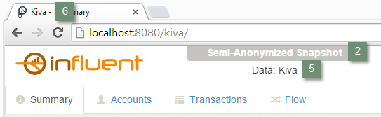

# Client Configuration #

The following sections describe the client-side modules and parameters you should configure before deploying your Influent application.

- [Header](#header-config)
- [Transaction Flow](#transaction-flow)
- [Cards](#cards)

**NOTE**: For a complete list of configurable client-side parameters, see the [Client Settings](../../reference/client/) reference topic.

## <a name="header-config"></a>Header ##

The Influent header contains information about the data source to which the application is connected and links to the developer and end user help.

<h6 class="procedure">To edit the Influent header components</h6>

1. Open the [branding.css](https://github.com/unchartedsoftware/influent/blob/master/influent-app/src/main/webapp/theme/branding.css) file in your project's [src/main/webapp/theme/](https://github.com/unchartedsoftware/influent/tree/master/influent-app/src/main/webapp/theme) folder.
2. Edit the value of the *content* property for the **.banner-text:before** selector to modify the banner that indicates the scope of the source dataset.
3. Save the **branding.css** file.
4. Open the [client-config.js](https://github.com/unchartedsoftware/influent/blob/master/influent-app/src/main/resources/client-config.js) file in your project's [src/main/resources/](https://github.com/unchartedsoftware/influent/tree/master/influent-app/src/main/resources) folder.
5. Edit the **datasource** parameter to specify the name of your data source. In a secure environment, this property can be used to display classification.
6. Edit the **title** to specify the title of your application as it will appear in the end user's Web browser and bookmarked links.



## <a name="transaction-flow"></a>Transaction Flow ##

The Flow view, Influent's workspace for investigating the flow of transactions, allows users to visualize activity over a customizable date range.

<h6 class="procedure">To specify the default date range</h6>

1. In your [client-config.js](https://github.com/unchartedsoftware/influent/blob/master/influent-app/src/main/resources/client-config.js) file, set the **startingDateRange** to one of the following values:
<div class="props">
		<table class="summaryTable" width="100%">
			<thead>
				<tr>
					<th scope="col" width="20%">Value</th>
					<th scope="col" width="80%">Description</th>
				</tr>
			</thead>
			<tbody>
				<tr>
					<td class="value"><em>P14D</em></td>
					<td class="description">2 weeks</td>
				</tr>
				<tr>
					<td class="value"><em>P112D</em></td>
					<td class="description">16 weeks</td>
				</tr>
				<tr>
					<td class="value"><em>P1Y</em></td>
					<td class="description">1 year</td>
				</tr>
				<tr>
					<td class="value"><em>P16M</em></td>
					<td class="description">16 months</td>
				</tr>
				<tr>
					<td class="value"><em>P4Y</em></td>
					<td class="description">4 years</td>
				</tr>
				<tr>
					<td class="value"><em>P16Y</em></td>
					<td class="description">16 years</td>
				</tr>
			</tbody>
		</table>
</div>
	**NOTE**: Custom values are not supported, as this would require a change to the Influent Transaction database schema.
2. Edit the **defaultEndDate** property to specify the last date (<em>MMM D, YYYY</em>) in the range you selected.

## <a name="cards"></a>Cards ##

In the Influent workspace, the cards that represent the accounts in your transaction and entity data display a set of icons that indicate key account attributes. 

A set of default icons are available for your use in the Aperture JS project ([aperture-icons/src/main/resources/oculus/aperture/icons/hscb/entity/actor/](https://github.com/unchartedsoftware/aperturejs/tree/master/aperture-icons/src/main/resources/oculus/aperture/icons/hscb/entity/actor)).

<h6 class="procedure">To edit which fields and icons are displayed on cards</h6>

1. In your [client-config.js](https://github.com/unchartedsoftware/influent/blob/master/influent-app/src/main/resources/client-config.js) file, edit the **iconMap** property to include icon mappings for each of the [FL\_PropertyTag](../connect-data/#fl_propertytag) names that correspond to the attributes you want to display.
2. For each mapping, create cases for all of the possible values for the corresponding field. At a minimum, each case requires:
	<div class="props">
		<table class="summaryTable" width="100%">
			<thead>
				<tr>
					<th scope="col" width="15%">Property</th>
					<th scope="col" width="85%">Description</th>
				</tr>
			</thead>
			<tbody>
				<tr>
					<td class="property">title</td>
					<td class="description">Name that appears in a tooltip when the user hovers the mouse over the icon</td>
				</tr>
				<tr>
					<td class="property">icon</td>
					<td class="description">A default Aperture JS icon:
						<ol>
							<li>Specify the location of the icon by setting the <strong>type</strong> to the name of its parent folder in the <a href="https://github.com/unchartedsoftware/aperturejs/tree/master/aperture-icons/src/main/resources/oculus/aperture/icons/hscb/entity/actor/organization"><em>aperture-icons/<wbr>src/<wbr>main/<wbr>resources/<wbr>oculus/<wbr>aperture/<wbr>icons/<wbr>hscb/</em></a> folder of the Aperture JS project.</li>
							<li>If the specified folder contains multiple icons, use the <strong>attributes</strong> to indicate the subfolder in which the icon is found and pass in its name.</li>
						</ol>
					</td>
				</tr>
				<tr>
					<td class="property"><em>url</em></td>
					<td class="description">Location of a custom image:
						<ol>
							<li>Copy your custom images to your project's [src/main/webapp/img/](https://github.com/unchartedsoftware/influent/tree/master/influent-app/src/main/webapp/img) folder.</li>
							<li>Set the *url* to *'img/file-name.png'*.</li>
						</ol>
					</td>
				</tr>
			</tbody>
		</table>
	</div>
3. For each mapping, edit the **limit** property to specify the maximum number of icons of a particular type that can appear on a card.
4. Edit the **iconOrder** to specify the order in which icons should be displayed. Make sure you enter all the *FL\_PropertyTag* names you listed in the **iconMap** property.

	```
	iconOrder : ['TYPE', 'GEO', 'STATUS', 'WARNING'],
	```

5. Save the **client-config.js** file.

#### Examples ####

The following example from the Kiva application illustrates how to use default Aperture JS icons to indicate to which of the three types (*lenders*, *partners* or *borrowers*) an account belongs.

```js
TYPE : {
	map : function(name, value) {
		switch (value) {
			case 'lender':
				return {
					title: 'lender',
					icon: {type: 'Person', 
						   attributes: {role: 'business'}}
				};
			case 'partner':
				return {
					title: 'partner',
					icon: {type: 'Organization',
						   attributes: {role: 'business'}}
				};
			case 'loan':
				return {
					title: 'borrower / loan',
					icon: {type: 'Person'}
				};
		}
	},
	limit : 1
},
```

This example from the Bitcoin application illustrates how to use custom icons to quantify the number of transactions in which an account has participated.

```
STAT : {
	map : function (name, value) {
		switch (name) {
			case 'NumTransactions':
				if (value < 2360537) {
					return {
						title: value,
						url: 'img/pulse-1.png'
					};
				} else if (value >= 2360537 && value < 4721075) {
					return {
						title: value,
						url: 'img/pulse-2.png'
					};
				} else if (value >= 4721075 && value < 7081613) {
					return {
						title: value,
						url: 'img/pulse-3.png'
					};
				} else if (value >= 7081613 && value < 9442151) {
					return {
						title: value,
						url: 'img/pulse-4.png'
					};
				}
```

## Next Steps ##

For information on building your custom project and deploying it to a web server, see the [Deployment](../deployment) topic.

For more information on advanced client settings, see the [Client Settings](../../reference/client/) reference topic.