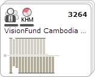
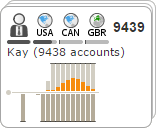
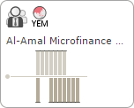
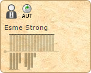
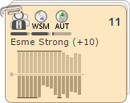

Entity Representations
==============================

The following sections describe advanced entity representation features that are not enabled in the generic financial Influent application. To explore these features, see the [live Kiva demo](http://community.influent.org/kiva/).

##  Account Owners ##

An account owner represents a large group of accounts owned by the same entity. These entities, which like clusters can be expanded or collapsed, are used to simplify the Influent workspace and search results and to optimize application performance.

Collapsed account owners display aggregate summary information about the account attributes and transaction data of their child entities.

You can interact with account owners on the following tabs in Influent:

- [Accounts](../../how-to/interface/#accounts), where you can search for account owners based on identifying attributes
- [Flow](../../how-to/interface/#flow), where you can visualize and investigate the transactions in which account owners are involved.

**NOTE**: For account owner entities to appear in your Influent deployment, your administrator must create records for them and insert them into your Transaction database. It is up to each deployment to determine -- based on available system resources and the extent of the source dataset -- when to include account owners and how to group together individual accounts.

##  Cluster Summaries ##

A cluster summary is an entity that represents a pre-aggregation of a large group of related accounts. These entities, which unlike clusters and account owners cannot be expanded or collapsed, are used to simplify the Influent workspace and optimize application performance. 

Cluster summaries display aggregate summary information about the account attributes and transaction data of their child entities.

Cluster summaries can be used to pre-aggregate two types of account groups:

- Large groups of accounts (>1,000) that branch off a single entity
- Particularly large account owners

You can interact with cluster summaries only on the [Flow](../../how-to/interface/#flow) tab.

**NOTE**: For cluster summary entities to appear in your Influent deployment, your administrator must create records for them and insert them into your Transaction database. It is up to each deployment to determine -- based on available system resources and the extent of the source dataset -- when to include cluster summaries and how to group together individual accounts.

##  Uncertainty ##

Card backgrounds can be configured to indicate the level of certainty about the transactions in which it is involved: 

- **White Background**: The dataset for the account represented by the card is complete, and there is no uncertainty about its transactions.
- **Parchment Background**: The dataset for the account represented by the card is incomplete. Uncertainty exists about the exact transactions the account has made.
In the Kiva application, parchment backgrounds are displayed for lender accounts, as the total amount of each loan to the borrower is known, but not the exact amount from each lender.

- **Mixed Background**: Only appears on clusters with a mix of entities with varying levels of certainty. Identified by the lack of "dirtiness" that appears on the uncertainty parchment background.

<table cellpadding="10" align="center">
	<tr>
		<td></td>
		<td></td>
		<td></td>
	</tr>
	<tr>
		<td class="caption">Certainty</td>
		<td class="caption">Uncertainty</td>
		<td class="caption">Cluster Uncertainty</td>
	</tr>
</table>