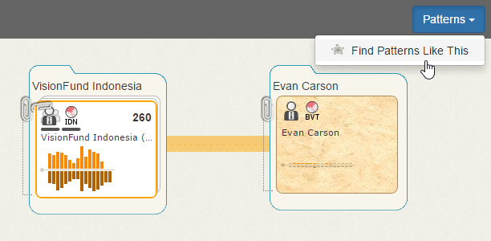
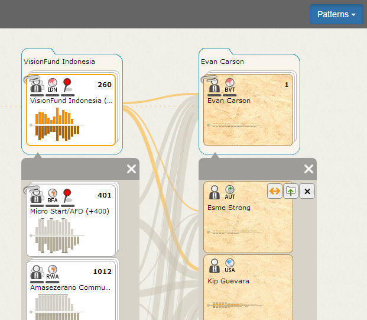

Searching for Similar Patterns
==============================

After you identify and file accounts of interest, you can use Influent's transactional pattern search capabilities to find accounts with similar activity histories. Influent is designed to support plugin modules to enable transactional pattern searching. 

The example apps are designed to utilize the [Graph Query-by-Example (QuBE)](https://github.com/mitll/graph-qube) tool created by MIT Lincoln Labs (MIT-LL) in collaboration with Giant Oak. Starting with an example account or accounts, Graph QuBE searches for accounts with similar activity histories. 

**NOTE**: Pattern searches are not enabled in the generic financial Influent application. To explore these features, see the [live Kiva demo](http://community.influent.org/kiva/).

##  How Pattern Searches Work ##

When returning results, Graph QuBE performs a two-stage query that looks for the following features:

1. **Individual account activity features**
	- Average behavior of an account's interactions with other accounts:
		- Average number of transactions (incoming and outgoing)
		- Distribution of transactions (incoming and outgoing)
		- Average time between transactions
2. **Transactional features** 
	- Two types of transactional features between accounts:
		- **Transaction-level features** 
			- How transactions compare to the whole dataset:
				- Deviation of the value from all other transactions
				- Deviation of the incoming/outgoing value from all other transactions of that type made by the account
		- **Event-level features** 
			- How transactions compare to all other transactions in the specified transaction flow period:
				- Deviation of the value from all other transactions
				- Deviation of the incoming/outgoing value from all other transactions of that type made by the account
				- Time since the previous transaction
				- Relative change in value from the previous transaction

## Find Similar Patterns ##

When your workspace contains several filed accounts connected by transactions, you can use the **Find Patterns Like This** command in the **Patterns** menu (located in the upper right corner). Influent will search for other accounts with transactions between them that are similar to the accounts filed in your workspace.

### Navigating Search Results ###

Influent returns paginated lists of results for each of the example accounts in your workspace. These lists are loaded in the workspace below each example file.

By default, Influent returns the top 50 results for each account. Each page contains 12 results. Both of these values are configurable for each deployment of Influent.

**NOTE**: You cannot branch off of pattern search results until they have been filed.

<h6 class="procedure">To add a result to a file</h6>

1. Mouse over the result and click its **Add to File**  button.
2. Once you file the result, you can further investigate its account activity by branching to visualize all of its incoming and outgoing transaction.