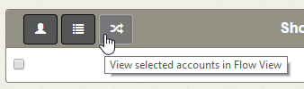
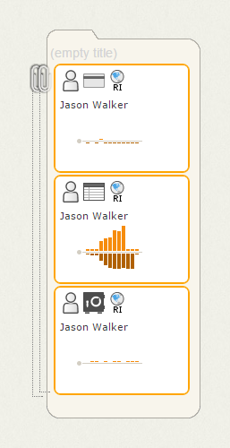
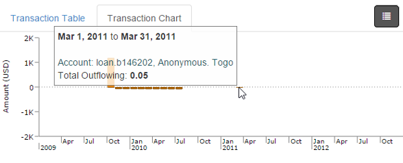
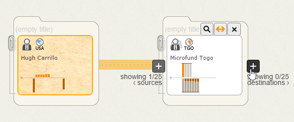
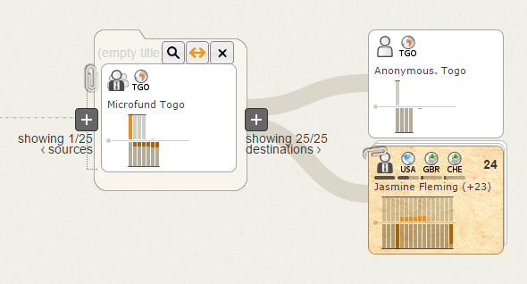
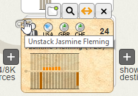
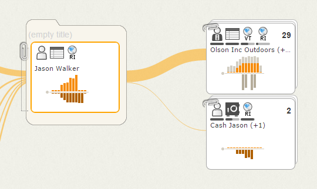

Exploring Transaction Flow
==========================

Now that we have several accounts to explore, we can view them on the Flow tab to visualize and interactively expand their transaction histories.

##  Populate the Flow Tab ##

The Flow tab is a workspace to branch off accounts of interest and reveal accounts for which we previously had no information.

<h6 class="procedure">To view accounts on the Flow tab</h6>

1. Select the checkbox to the left of each *Jason Walker* account.
2. Click the **View selected accounts in Flow View** button.

All three accounts appear in the Flow workspace as a collapsed cluster, which aggregates and summarizes their attributes and activity.

<h6 class="procedure">To view the individual accounts</h6>

- Click the paperclip icon to expand the cluster and show its child entities.

##  Managing the Flow Workspace ##

<h6 class="procedure">To understand the account representations in the Flow workspace</h6>

1. Hover your mouse over the icons on the cards in the workspace to see basic attributes of the corresponding account such as: 
	- **Type** (*Credit Card*, *Checking* or *Savings*)
	- **Location** (*Rhode Island*)
2. Review the Transaction Activity charts on the cards for suspicious patterns such as structuring. These chart show aggregate inflowing and outflowing transactions above and below the x-axis, respectively.

Note that *Jason Walker's* Savings and Credit Card accounts appear to have consistent activity over time. We can remove these from the Flow view and narrow our investigation into his Checking account.

<h6 class="procedure">To narrow the focus of the workspace</h6>

1.  Hover over *Jason Walker's* Savings and Credit Card accounts and click the **Remove**&nbsp; button to clear them from the workspace.
2. Click *Jason Walker's* Checking account to open the Details Pane, which lists the account's attributes and transaction history.
3. Select the Transaction Chart tab to see an expanded view of the account's activity history.
4. Here we see a clear, dramatic spike in activity between two more moderate periods of transactions.

##  Branching to Reveal Connected Accounts ##

The iterative branching capabilities of the Flow workspace allow us to identify unknown accounts connected to *Jason Walker*. 

The Flow workspace maps transactions from left to right, letting us simply follow the money across the screen. The thickness of links between accounts indicate the value of their transactions.

<h6 class="procedure">To expand Jason Walker's transaction flow</h6>

1. Hover over the *Jason Walker* card to show its **Branch** buttons. Click the left **Branch** button to see accounts that sent funds to *Jason Walker*.
2. Note that two groups of entities sent money to *Jason Walker*: a cluster of 4 personal accounts and a single commercial account.
3. Click the paperclip over the cluster of personal accounts to view the child accounts it contains.
4. Note that *Jason Walker’s* funds come from his own cash deposits as well as three other individuals.
5. Hover your mouse over *Jason Walker* and click the right **Branch** button to see where he sent funds.
6. Notice two groups of entities: a cluster of 29 commercial accounts and a cluster of two personal accounts also belonging to *Jason Walker*.

From here, we can explore the transaction flow of the destination commercial accounts for suspicious behavior.

## Next Steps ##

[Understanding expected transaction patterns](../recognize-patterns/) in your source data is key to using Influent. Exceptions to these features may indicate suspicious behavior.