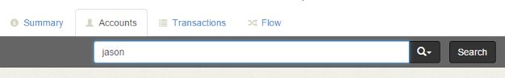
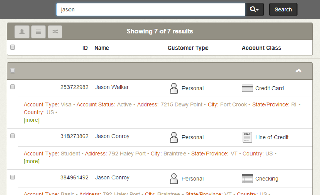
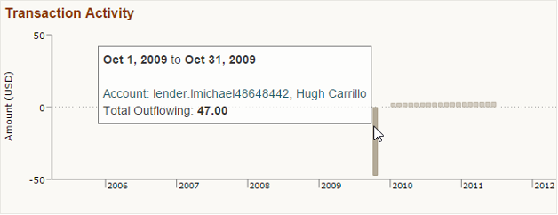

Finding Accounts of Interest
============================

To begin the investigation, access the Accounts tab, which lets us search for entities based on known identifying attributes.

##  Searching for Accounts ##

<h6 class="procedure">To search for an account</h6>

1. Click the **Search Accounts** button on the Summary tab.
2. Enter *jason* in the Accounts tab search bar and press ENTER.

### Reviewing Accounts Search Results ###

Influent displays summaries of seven accounts that match all our search criteria.

 

<h6 class="procedure">To review an individual result</h6> 

- Click the **more** button  under each of the results named *Jason Walker* result to reveal account attributes that answer the following questions:
	- **When were the accounts active?**
		<ol type="a">
			<li>Scroll to the <strong>Earliest Transaction</strong> and <strong>Latest Transaction</strong> attributes.</li>
			<li>Review the <strong>Transaction Activity</strong> chart, which illustrates the history of aggregate funds coming into (above the x-axis) and going out (below) of the account.</li>
		</ol>
	- **With whom did the account participate in transactions?**
		<ol type="a">
			<li>Scroll to the <strong>Inbound Transfers</strong> and <strong>Outbound Transfers</strong> attributes to see how many other accounts connect with *Jason Walker*.</li>
		</ol>
	- **How much money was involved?**
		<ol type="a">
			<li>Review the <strong>Average Transaction</strong> attribute.</li>
			<li>Hover your mouse over the bars in the <strong>Transaction Activity</strong> chart to see the aggregate inflowing and outflowing values in each month.</li>
		</ol>

While we now know generally when and how much money was sent to/from *Jason Walker's* accounts, the Accounts tab does not identify the other transaction participants.

To expand *Jason Walker's* network, we need to view the account's activity on the Flow tab.

## Next Steps ##

Now that we have several accounts to explore, we can view them on the Flow tab to visualize and interactively [expand their transaction histories](../explore-flow/).