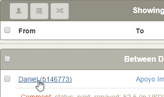
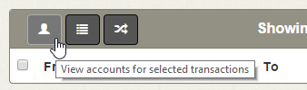
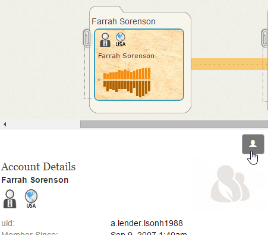
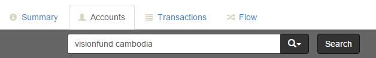
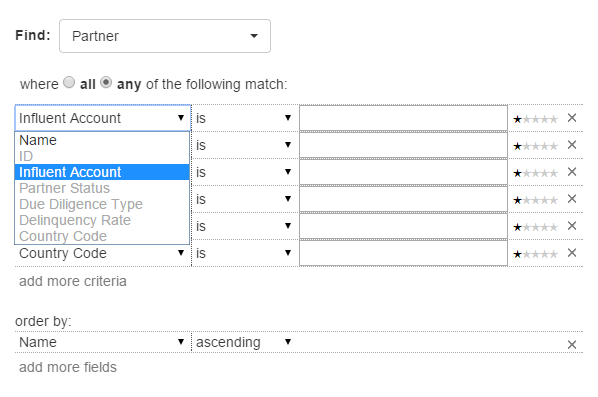
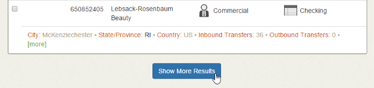
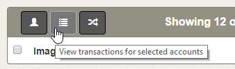
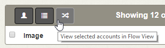
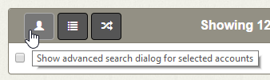

Searching for Accounts
======================

The Accounts tab enables you to search for accounts based on known identifying information. When starting a new investigation, this is generally the first search you will perform.

##  Investigating Accounts of Interest ##

If you have already used the Transactions or Flow tab to reveal an account that you want to investigate, you can quickly switch to the Accounts tab to view a complete list of its identifying attributes and its full transaction history.

For more information on reviewing account details on the Account tabs, see [Reviewing Results](#reviewing-results).

<h6 class="procedure">To access the account details of a single account from the Transactions tab</h6>

In the **Debit Account** or **Beneficiary Account** column, click the ID of the account you want to investigate.

<h6 class="procedure">To access the account details of two linked accounts from the Transactions tab</h6>

1. Select the checkboxes for the transaction containing the accounts that you want to investigate.
2. Click the **View Accounts for Selected Transaction** button.

<h6 class="procedure">To access the account details of accounts from the Flow tab</h6>

1. Click the card or stack that you want to investigate to open the [Details pane](../interface/#details-pane).
2. Review the Account Details, which lists all of the account's identifying attributes.
3. To access the Accounts tab, click the **View Accounts for Selected Entity** button.

##  Performing Searches ##

The Accounts tab guides you through the process of finding accounts of interest and saving them for investigation. It supports both simple string searches and more advanced searches with:

- Multiple account attribute criteria
- *Any*/*all* logic to control the breadth of results
- Non-exact fuzzy matching to correct for typos and return results similar to what you entered
- Weighted criteria to indicate which attributes are most important

###  Simple Searches ###

<h6 class="procedure">To execute a string search using an account name or ID</h6>

1. In the Accounts tab search bar, enter the name of the account you want to find. 
2. Alternatively, if you know the ID of the account you want to find, enter it as:

	`ENTITY:"<account_id>"`

3. Click **Search**.

###  Advanced Searches ###

<h6 class="procedure">To execute an advanced search using other account attributes</h6>
<ol>
	<li>Click the <strong>Advanced Search</strong>  button.</li>
	<li>Determine whether you want Influent to return only results that match <strong>All</strong> of your search criteria or results that match <strong>Any</strong> subset of your criteria.</li>
	<li>Configure your search criteria:
		<ol type="a">
			<li>Choose an attribute from the <strong>Criteria</strong> drop-down list.</li>
			<li>Select one of the following options from the <strong>Match</strong> drop-down list to configure non-exact fuzzy matching:
				

					<table class="summaryTable">
						<thead>
							<tr>
								<th scope="col">Field Type</th>
								<th scope="col">Match Type</th>
								<th scope="col">Return Results That</th>
							</tr>
						</thead>
						<tbody>
							<tr>
								<td class="description" rowspan="5">String</td>
								<td class="value">Is</td>
								<td class="description">Match or contain the search terms</td>
							</tr>
							
							<tr>
								<td class="value">Is&nbsp;very&nbsp;like</td>
								<td class="description">Are <em>highly</em> similar to the search terms</td>
							</tr>
							
							<tr>
								<td class="value">Is&nbsp;like</td>
								<td class="description">Are similar to the search terms</td>
							</tr>
							
							<tr>
								<td class="value">Is&nbsp;vaguely&nbsp;like</td>
								<td class="description">Are <em>vaguely</em> similar to the search terms.</td>
							</tr>
							
							<tr>
								<td class="value">Is&nbsp;NOT</td>
								<td class="description"><em>Do not</em> match or contain the search terms</td>
							</tr>
							<tr>
								<td class="description" rowspan="5">Numeric</td>
								<td class="value">Between</td>
								<td class="description">Fall between two search terms</td>
							</tr>
							
							<tr>
								<td class="value">Is</td>
								<td class="description">Match the search terms</td>
							</tr>
							
							<tr>
								<td class="value">Greater than</td>
								<td class="description">Are greater than the search terms</td>
							</tr>
							
							<tr>
								<td class="value">Less than</td>
								<td class="description">Are less than the search terms</td>
							</tr>
						</tbody>
					</table>
				

			</li>
			<li>In the text box, enter the terms or values for which you want to search.</li>
			<li>If necessary, use the stars to indicate the relative importance of your criteria. More stars mean a term is more important.
Weighted terms are most useful when searching for results that match or are <em>like</em> your criteria.
</li>
			<li>If necessary, click <strong>Add More Criteria</strong> to include additional attributes in your search. Repeat the previous four steps for each criteria you add.</li>
		</ol>
	</li>
	<li>Configure how you want your results to be ordered:
		<ol type="a">
			<li>Use the <strong>order by</strong> drop-down list to choose an attribute.</li>
			<li>Select <em>ascending</em> or <em>descending</em> from the <strong>Order</strong> drop-down list to choose how result groupings are displayed.</li>
			<li>If necessary, click <strong>Add More Fields</strong> to include additional order by rules.</li>
		</ol>
	</li>
	<li>Click <strong>Search</strong></li>
</ol>

### Executing Account Searches from the Flow Tab ###

<h6 class="procedure">To execute a search for accounts similar to an example in the Flow tab</h6>

1. Hover over the card in the Flow workspace and click its **Search for Similar Accounts**  button.
2. Influent displays the Accounts tab with an Advanced Search dialog pre-populated with the attributes of the selected account.
3. Modify the Advanced Match Criteria as necessary and click **Search**.

## Navigating Search Results ##

By default, the Accounts tab returns a list of the top 50 results for the search terms that you entered. Initially, only 12 results are displayed. You can expand the list at any time to view more of the top results.

The Accounts tab operations bar lists the number of accounts that match your search criteria; if this number is larger than 50, it may be helpful to narrow your search by entering additional criteria in the Advanced Search dialog.

Results are grouped by a configurable account attribute. By default, results are grouped by how similar they are to your search criteria.

### Loading Results ###

<h6 class="procedure">To view more top results</h6>

1. Scroll to the bottom of the results list and click the **Show More Results** button to display 12 more results.
2. Repeat step 1 as necessary until you reach the results limit.

###  Reviewing Results ###

Individual results are listed in an abbreviated format to show only key account attributes (e.g., names, unique IDs, account types). Each result can be expanded to show a detailed attribute list and a chart illustrating the account's complete transaction history.

<h6 class="procedure">To view more details about an individual result</h6>

Click the **more** button  in the account overview.

The Details view for an individual account lists the following information:

- An expanded description
- Other attributes specific to the account type
- Complete transaction history table and chart

### Selecting Results for Further Investigation ###

Any search result can be viewed on the Transactions or Flow tabs for further investigation of its transactions with other accounts.

<h6 class="procedure">To view a sorted list of transactions for a result</h6>

1. Select the checkbox next to the results you want to investigate.
2. Click the **View transactions for selected accounts** button.

<h6 class="procedure">To interact with a visualization of the transactions involving a result</h6>

1. Select the checkbox next to the results you want to investigate.
2. Click the **View selected accounts in Flow View** button.

<h6 class="procedure">To find accounts similar to a result</h6>

1. Select the checkbox next to the results you want to investigate.
2. Click the **Show Advanced Search** button to load the Advanced Search dialog, which will be pre-populated with the details of the selected results.
3. Modify any of the pre-populated criteria as necessary.
4. Click **Search**.

## Next Steps ##

For information on exploring the transactions involving entities you identified via the Accounts search, see the [Investigating Transaction Flow](../investigate-flow/) topic.