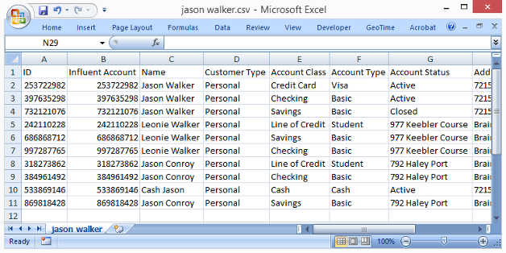
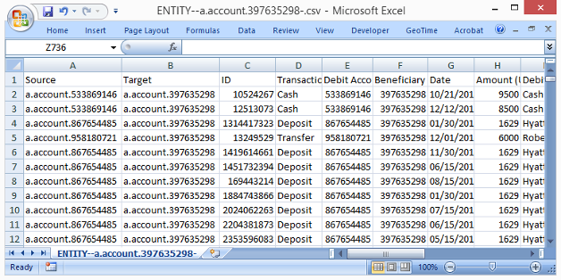

Importing and Exporting Data
============================

Influent enables you to import and export transaction flow data from the Flow tab in order to:

- Save transaction flow data across multiple Influent sessions
- Share transaction flow data with other analysts that use Influent
- Share transaction flow data with individuals who do not have access to Influent

##  File Formats ##

Influent supports the following file formats:

- **Influent Files (XML)**: Save and work with files, folders and transaction flow information across multiple sessions. 
<strong>NOTE</strong>: Influent XML files (*.infml) do not contain pattern search results or other unfiled accounts loaded in the workspace.

- **Workspace Images (PNG)**: Save a complete screenshot of the Flow workspace as an image that can be easily included in reports or emailed to individuals without access to Influent.
- **Detailed Account Attributes (CSV)**: Save detailed account attribute data to a comma-separated values (CSV) file that can be opened or imported into your spreadsheet or database program of choice.
- **Detailed Transaction History (CSV)**: Save detailed transaction records to a comma-separated values (CSV) file that can be opened or imported into your spreadsheet or database program of choice.

##  Importing Flow Workspace Data ##

You can use Influent's import functionality to open Flow workspace data that was saved from a previous session or shared with you by another analyst. Only Influent XML files (\*.infml) are supported for import.

**NOTE**: The import process will overwrite any information you have in your current workspace. It is recommended that you export any data you don't want to lose before proceeding with an import.

<h6 class="procedure">To import previously saved Influent Flow workspace data</h6>

1. Select **Import Chart** from the **File** menu.
2. Browse to the location of the Influent XML file (\*.infml) you want to import and click **Open**.

Your Influent workspace is refreshed to show the filed accounts, relational transaction flow data and workspace focus contained in the XML file.

##  Exporting Flow Workspace Data ##

You can use Influent's export functionality to save and share Influent data from Flow workspace.

### Flow Workspace Data ###

Flow workspace data can be saved to an XML-formatted file that contains all of the filed accounts in your workspace. This format also retains the relational links between those accounts and the focus of your workspace (highlighted and selected accounts) at the time of export.

<h6 class="procedure">To export an Influent XML file</h6>

1. Make sure that all of the accounts you want to save are filed in the workspace. Unfiled accounts and pattern search results will not be saved to the XML file.
2. Select **Export Chart** from the **File** menu.
3. The XML is automatically saved to the download location specified in your Web browser (e.g., *C:\\Users\\jsmith\\Downloads*) as *influent-saved.infml*. We recommend you rename the file to indicate when it was generated and/or the nature of its contents.

### Flow Workspace Images ###

You can also save your Flow workspace data as an image that can be included in a report or shared with individuals without access to Influent. Exported images show:

- The entire Influent workspace (i.e., accounts in the workspace, in files and in the Activity Search Results)
- The header with the Transaction Flow period.

**NOTE**: Exported images do not include the Details pane for the selected account.

<h6 class="procedure">To export an image of the transaction flow data in your Flow workspace</h6>

1. Select **Export Image** from the **File** menu.
2. The PNG is automatically saved to the download location specified in your Web browser (e.g., *C:\\Users\\jsmith\\Downloads*) as *influent-snapshot.png*. We recommended you rename the file to indicate when it was generated and/or the nature of its contents.

##  Exporting Account Data ##

The [Accounts tab](../interface/#accounts) lists accounts that match your search criteria. You can export this information to a CSV file that can be included in a report or shared with individuals without access to Influent.

<h6 class="procedure">To export the accounts list to a CSV file</h6>

1. Select **Export Accounts** from the **File** menu.
2. The CSV is automatically saved to the download location specified in your Web browser (e.g., *C:\\Users\\jsmith\\Downloads*) with the filename set to the search criteria you entered to retrieve the accounts. We recommended you rename the file to indicate when it was generated.

##  Exporting Transaction Data ##

The [Transactions tab](../interface/#transactions) lists transactions that match your search criteria. You can export this information to a CSV file that can be included in a report or shared with individuals without access to Influent.

<h6 class="procedure">To export the transactions list to a CSV file</h6>

1. Select **Export Transactions** from the **File** menu.
2. The CSV is automatically saved to the download location specified in your Web browser (e.g., *C:\\Users\\jsmith\\Downloads*) with the filename set to the search criteria you entered to retrieve the transactions. We recommended you rename the file to indicate when it was generated.

