Navigating the Interface
=========

The Influent user interface is divided into the following sections:

- [Header](#influent-header): View a brief description of the dataset and access the command menus
- [Summary](#summary): View key summary statistics about the dataset to which Influent is configured
- [Accounts](#accounts): Quickly find accounts of interest before you begin to investigate their transaction flow
- [Transactions](#transactions): Find individual transaction records based on the participating entities, date or value
- [Flow](#flow): Visualize and interact with the incoming and outgoing transaction flow for accounts of interest

## Header ##

The Influent Header contains the elements described in the following sections.

### Data Source Name ###

This configurable banner indicates the data source with which you are working.

### Menus ###

The Influent menus allow you to quickly configure the Flow workspace, manage imports and exports and access this help system.

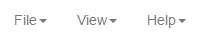

- **File** menu: Commands for opening a blank Flow workspace, importing Flow workspace data, and exporting account, transaction and Flow workspace data.
- **View**: Commands for configuring the level of account detail displayed in the Flow workspace.
- **Help**: Commands for accessing this help system.

## Summary ##

The Summary tab provides an overview of the transaction data to which your Influent deployment is configured. In addition to a dataset description, this tab also lists the following statistics that highlight the scope of entities and transactions in your data:

- **Accounts**: Total number of accounts
- **Transactions**: Total number of transactions
- **Earliest Transaction**: Earliest date on which a transaction was recorded
- **Latest Transaction**: Most recent date on which a transaction was recorded

**NOTE**: The summary statistics listed above are generated by default. Your administrator can configure your Influent deployment to show additional metrics if required.

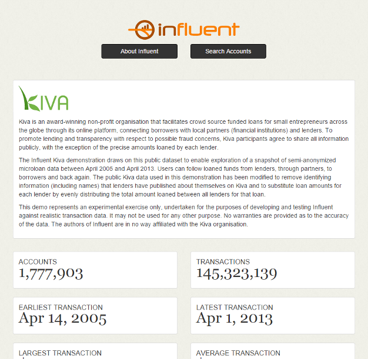

## Accounts ##

The Accounts tab enables you to find accounts of interest based on known attributes (such as ID, name, account class, etc.). The Accounts tab supports both simple, free text searches and advanced searches with boolean logic, fuzzy matching and weighted terms. 

Results are returned as a paginated list of accounts that match your criteria.

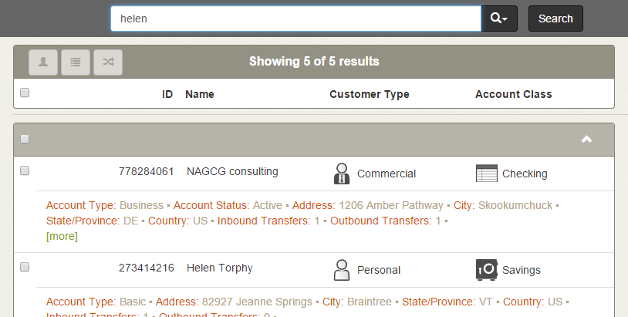

Click the **more** button  in the results to view more details about an account. The expanded result lists additional account attributes and complete transaction history chart.

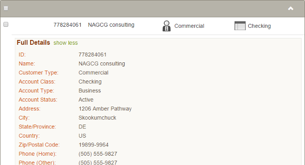

When you identify accounts of interest on the Accounts tab, you can view them on the:

- [Transactions](#transactions) tab to inspect the individual transactions in which the selected accounts participated
- [Flow](#flow) tab to visualize and interact with transaction flow for the selected accounts

## Transactions ##

The Transactions tab enables you to find transactions of interest based on known attributes (such as the identity of the sender or receiver, the date, the value, etc.). The Transactions tab supports simple, free text searches and advanced searches with boolean logic, fuzzy matching and weighted terms.

Results are returned as a paginated list of transactions that match your criteria.

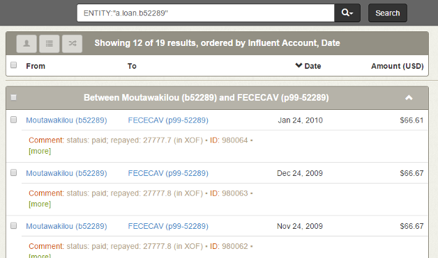

When you identify accounts of interest on the Accounts tab, you can view them on the:

- [Accounts](#accounts) tab to inspect the entities involved in the selected transaction
- [Flow](#flow) tab to visualize and interact with transaction flow for the selected accounts

## Flow ##

The Flow tab is a workspace for investigating accounts of interest by visualizing and interactively expanding their transaction history.

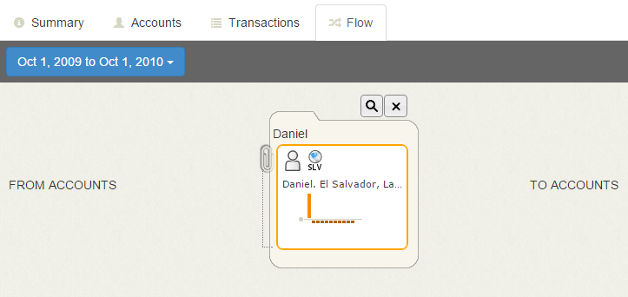

The Flow workspace is powered by the components described in the following sections.

### Transaction Flow ###

This control enables you to quickly change the time frame over which to display transactions in the workspace. Setting the **Start Date** and **End Date** fields prompts Influent to suggest predefined time periods for you to view.

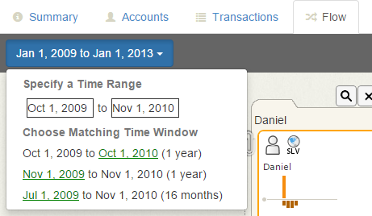

### Entity Representations ###

Each account in the workspace is represented as a single card, with the name of the account, its type, location, status (if applicable) and a chart showing its aggregate transaction values over time. A cluster is represented as a stack of cards held together by a paperclip, with similar summary information about all of the member accounts in the cluster.

<table cellpadding="10" align="center">
	<tr>
		<td>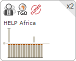</td>
		<td>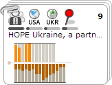</td>
	</tr>
	<tr>
		<td class="caption">Account</td>
		<td class="caption">Cluster</td>
	</tr>
</table>

For more information on entity representations in the Flow workspace, see the [Investigating Transaction Flow](../investigate-flow/#entity-representations) topic.

### Transaction Expansion ###

The Flow workspace allows you to expand the transactions that flow into and out of an account. Influent always depicts transaction flow from left to right, with senders on the left and receivers on the right.

Mouse over an account, then click one of the **Branch** buttons to the left or right of the card. Clicking the left **Branch** button shows all of the accounts that have sent transactions to the account, while the right **Branch** button shows accounts to which the account has sent transactions. 

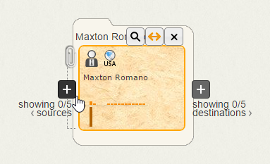

Lines between accounts indicate the total value of all the transactions sent by the account on the left to the account on the right. Thicker lines mean larger values. In the generic financial application, this means that the thicker the line between two accounts, the more money was sent.

You can add further clarity to your transaction flow chart by highlighting a specific account. The charts for all other accounts or clusters in the workspace will be refreshed to show the portion of their total transactions sent to or received from the highlighted account.

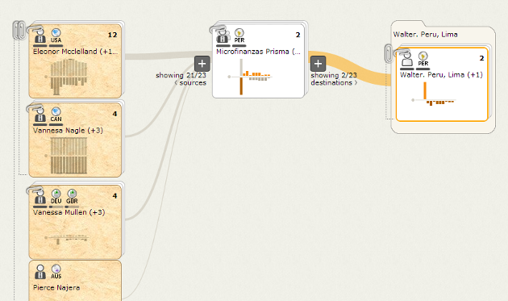

### Details Pane ###

The Details Pane is only visible when you click on an account. For a selected account, the Details Pane shows:

- **Account Details**: For accounts and account owners, this section shows the account's name, location, any associated images and a list of account attributes.
- **Cluster Member Summary**: For clusters and account owners, this section lists the number of member accounts in the cluster and the percentage of accounts that belong to each type, location and status.
- **Transaction Data**: The Transaction Data section is a group of tabbed transaction displays that show all of the selected account's transactions. The tabs in this section include:
	- **Transaction Table**: For accounts and account owners, this table lists the transactions made with the selected account over the specified Transaction Flow period. The table can also be filtered to show only transactions made with the account currently highlighted in the workspace (surrounded by an orange border).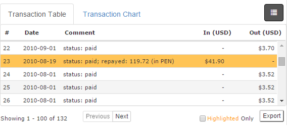
	- **Transaction Chart**: This chart is an expanded view of the chart that appears on the selected account card in the workspace. If there are any transactions between the selected account and the highlighted account, their values are shown in color.

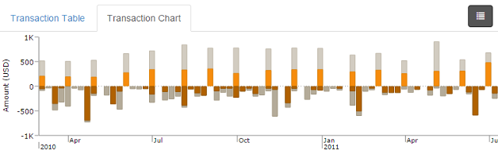

## Next Steps ##

For information on searching for accounts based on known attributes, see the [Searching for Accounts](../account-search) topic.