Investigating Transaction Flow
==============================

This topic describes how to investigate accounts of interest using the Flow tab, Influent's workspace for interacting with transaction flow history.

	<ul>
		<li><a href="#add-accounts">Adding Accounts to the Flow Tab</a>
		<li><a href="#transaction-flow-period">Setting the Transaction Flow Period</a>
		<li><a href="#workspace">Managing the Workspace</a>
		<li><a href="#entity-representations">Understanding Entity Representations</a>
		<li><a href="#investigating-entities">Investigating Entities</a>
		<li><a href="#branching">Branching Transaction Flow</a>
		<li><a href="#managing-entities">Managing Entities</a>
	</ul>

##  Adding Accounts to the Flow Tab ##

You can add accounts to the workspace by searching for entities or transactions on the Accounts or Transactions tabs and viewing the applicable results on the Flow tab.

<h6 class="procedure">To view entities from the Accounts tab in the Flow workspace</h6>

1. Switch to the Accounts tab.
2. Search for accounts using known attributes and review the results.
3. Select the checkboxes for the results of interest and click the **View selected accounts in Flow View** button.
4. Any accounts you selected are added to a new file in the Flow workspace and automatically clustered together.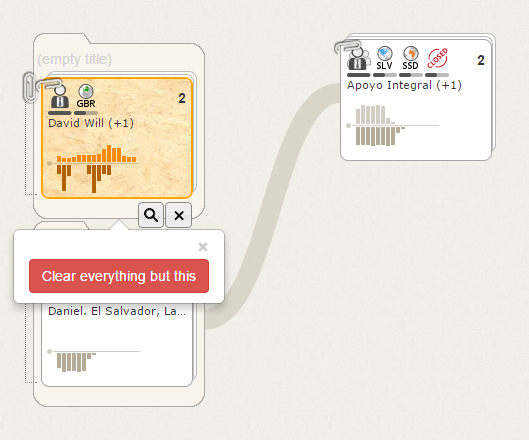
5. If you have other files or accounts in the workspace that you want to remove, click the **Clear everything but this** button.
6. Double click the *(empty title)* section of the file to enter a descriptive name for the accounts it contains.

<h6 class="procedure">To view entities from the Transactions tab in the Flow workspace</h6>

1. Switch to the Transactions tab.
2. Search for transactions using known details and review the results.
3. Select the checkboxes for the results of interest and click the **View selected accounts in Flow View** button.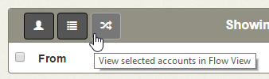
4. The accounts that participated in the transactions you selected are added to new files in the Flow workspace. The **From** entities are added to one file on the left side of the workspace, while the **To** entities are added to a file in the next column to the right. If you selected more than one transaction, the participating **From** entities are automatically clustered together as are the **To** entities.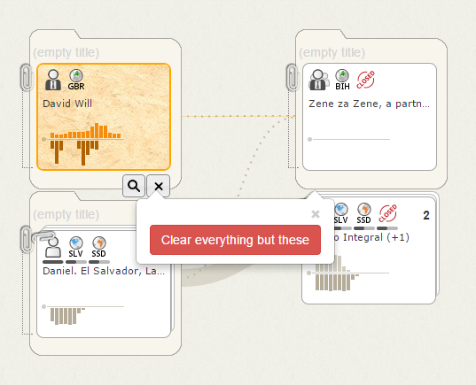
5. If you have other files or accounts in the workspace that you want to remove, click the **Clear everything but these** button.
6. Double click the *(empty title)* section of the new files to enter a descriptive names for the accounts they contains.

##  Setting the Transaction Flow Period ##

The first step in investigating an account is to choose a range of dates over which to view its transactions. The Transaction Flow period controls in the Flow tab header allow you to configure this range.

Setting the range requires two steps:

1. Choose the start and end dates you want to view.
2. Choose one of predetermined time intervals (e.g., two weeks) that overlaps with the date your selected.

Influent supports the following predetermined intervals. 

	<table class="summaryTable">
		<thead>
			<tr>
				<th scope="col">Interval</th>
				<th scope="col">Description</th>
			</tr>
		</thead>
		<tbody>
			<tr>
				<td class="value">2&nbsp;weeks</td>
				<td class="description">14-day period beginning or ending on any day</td>
			</tr>
			
			<tr>
				<td class="value">16&nbsp;weeks</td>
				<td class="description">16 calendar weeks running from Sunday to Saturday.</td>
			</tr>
			
			<tr>
				<td class="value">1&nbsp;year</td>
				<td class="description">12-month period beginning or ending on the first of any month</td>
			</tr>
			
			<tr>
				<td class="value">16&nbsp;months</td>
				<td class="description">16-month period beginning or ending on the first of any month</td>
			</tr>
			
			<tr>
				<td class="value">4&nbsp;years</td>
				<td class="description">4-year period beginning or ending on the first day of any quarter (Jan 1, Apr 1, Jul 1 or Oct 1)</td>
			</tr>
			
			<tr>
				<td class="value">16&nbsp;years</td>
				<td class="description">16 calendar years running Jan 1 to the following Jan 1</td>
			</tr>
			
		</tbody>
	</table>

**NOTE**: Due to how Influent builds transaction flow tables from your source data, the predetermined periods cannot be customized for new deployments of the application.

<h6 class="procedure">To choose an appropriate Transaction Flow Period</h6>

Because the Flow workspace allows you to discover previously unknown entities, at first you may not know the best period of time over which to investigate them. To quickly discover the full range of time over which an account is active:

1. [Select](#selected) the account in the workspace to view the [Details pane](../interface/#details-pane).
2. In the Account Details section, scroll down to the **Earliest Transaction** and **Latest Transaction** attributes.
3. Enter the full date range you want to investigate.
4. Choose one of the preconfigured time windows suggested by Influent.

##  Managing the Workspace ##

Before beginning your investigation, it is helpful to understand how the entities in your data are represented in the Flow workspace, which is your desktop for viewing, investigating and assessing transaction flow and accounts. 

The workspace is separated into [columns](#columns), each of which can contain any number of [files](#files) in which you organize accounts for investigation and unfiled accounts that branch off of accounts of interest.

###  Columns ###

A column in the Flow workspace is an structure that emphasizes the left-to-right flow of transactions. Accounts in columns on the left send transactions to accounts on the right.

As shown in the following figure, columns can contain [files](#files) or unfiled [branched](#branching) accounts. As new accounts are added to the workspace through branching, they are either appended to the bottom of an existing column or placed in a new column.

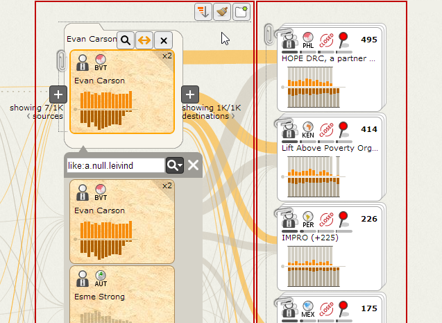

#### Managing Columns ####

<h6 class="procedure">To sort entities in a column</h6>

- Mouse over the workspace above the column, click the **Sort Column**  button and select a sorting method: *Incoming Flow*, *Outgoing Flow* or *Both*.

Entities are listed in descending order of the selected sorting method. Column sorting is useful when you:

- Branch off of more than one account or cluster in a column.
- Expand a cluster to reveal child accounts or clusters, then branch off of them. 

Regardless of the chosen sorting method, files and the accounts they contain always remain at the top of a column.

<h6 class="procedure">To clear unfiled entities from a column</h6>

- Mouse over the workspace above the column and click the **Clear Column**  button.

All unfiled content (branched accounts) is removed from the column.

###  Files ###

Files store and organize accounts you want to investigate.

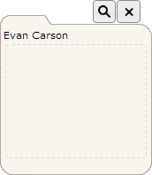

When you add multiple accounts to the same file, they are automatically clustered together to provide an aggregate view of all the accounts. You can expand or collapse the new cluster at any time to show or hide its child entities.

Files are also used to save accounts for [exporting](../import-export/). When exporting your Flow workspace to an XML file, only the accounts and clusters stored in files are saved; unfiled accounts are not included.

#### Creating New Files ####

<h6 class="procedure"> To add a new file to the top of a column</h6>

- Mouse over the workspace above the column and click the **Add New File**  button.

<h6 class="procedure">To create a new file containing an unfiled account already in the workspace</h6>

- Mouse over the account and click the **Move to File**  button. 

<strong>NOTE</strong>: The new file inherits the name of the selected account.

<h6 class="procedure">To add search results from the Accounts tab to a new file</h6>

1. Select the checkboxes for the desired results.
2. Click the **View Selected Accounts in Flow View** button.
3. To remove all other items in the workspace, click the **Clear everything but this** button.

#### Adding Accounts to Existing Files ####

<h6 class="procedure">To add accounts to an existing file</h6>

- Click and drag the desired account in the workspace into the file.

<h6 class="procedure">To search for accounts to add to a file</h6>

- Mouse over the file and click the **Search for Accounts to Add**  button to switch to the Accounts tab.

#### Managing Files ####

<h6 class="procedure">To rename a file</h6>

- Double click the file name, type the new name and press ENTER.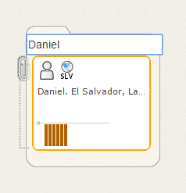

<h6 class="procedure">To remove a file</h6>

- Mouse over the file and click the **Remove**  button.

Deleting a file also deletes all of the entities inside of it.

##  Understanding Entity Representations ##

Understanding the representations of [entities](../concepts/#entities) in the Flow workspace is a key component of spotting unusual behavior. Each entity is represented by a card with a group of icons and a chart that summarize its attributes and activities. 

The different entity types have their own unique representations:

- Individual accounts are represented by cards
- Clusters are represented by a stack of cards held together by a paper clip

<table cellpadding="10" align="center">
	<tr>
		<td></td>
		<td></td>
	</tr>
	<tr>
		<td class="caption">Account</td>
		<td class="caption">Cluster</td>
	</tr>
</table>

As described in the following sections, the face of each card or stack indicates:

- Its [focus](#focus) within the workspace
- The [attributes](#summary-attributes) of the entities it represents
- Its [transaction history](#transaction-history) over the specified transaction flow period

###  Workspace Focus: Highlighted vs. Selected ###

The border of a card or stack indicates whether the workspace is currently configured to:

- Display expanded account and transaction attributes of the [selected](#selected) account
- Call out transactions involving the [highlighted](#highlighted) account 

The terms "highlighted" and "selected" are used throughout this help and should not be confused.

<table cellpadding="10" align="center">
	<tr>
		<td>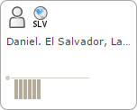</td>
		<td>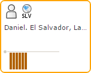</td>
		<td>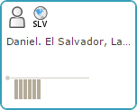</td>
	</tr>
	<tr>
		<td class="caption">No Focus</td>
		<td class="caption">Highlighted</td>
		<td class="caption">Selected</td>
	</tr>
</table>

####  Highlighted ####

A highlighted account is the current focal point of the Flow workspace. The highlighted card has an orange border. The following transaction flow details associated with all other cards in the workspace are drawn in relation to the highlighted card:

- Account Activity Charts are scaled in relation to the proportions of the highlighted account.
- Transactional data (all charts and flow lines) is represented in grayscale, except for portions of those transactions made directly with the highlighted account, which are represented in color.

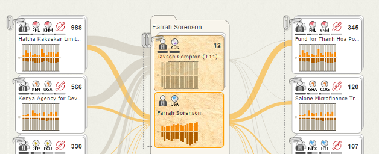

<h6 class="procedure">To change the highlighted card in the workspace</h6>

- Mouse over the desired card and click its **Highlight Flow**  button.

####  Selected ####

A selected account or cluster is one for which the [Details Pane](../interface/#details-pane) is currently displayed. The selected card has a blue border.

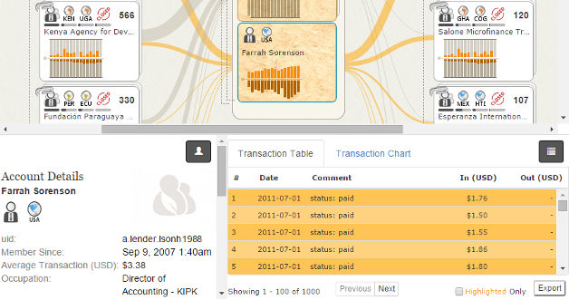

<h6 class="procedure">To change the selected card</h6>

- Click a new card in the workspace.

###  Summary Attributes ###

The text and icons on a card or stack indicate key account and transaction attributes that describe the account or cluster. Hover over an icon to view a tooltip explaining what it represents.

For clusters, a bar under each icon indicates the percentage of accounts in the group with the corresponding attribute. One icon type may appear multiple times on the same stack if the group contains accounts with different values for a single attribute (e.g., there may be two location icons if 75% of the accounts are in Spain and 25% are in France).

**NOTE**: Many of the icons below are specific to the generic financial application. Each implementation can be modified to show unique icons for any attribute in the source dataset.

	<table class="summaryTable">
		<thead>
			<tr>
				<th scope="col">Category</th>
				<th scope="col">Description</th>
				<th scope="col">Icon</th>
				<th scope="col">Name</th>
			</tr>
		</thead>
		<tbody>
			<tr>
				<td class="description">Name</td>
				<td class="description">Name of the account or cluster. Cluster names are chosen from among their child entities.
				</td>
				<td class="description"></td>
				<td class="value"></td>
			</tr>
			<tr>
				<td class="description" rowspan="2">Customer&nbsp;Type</td>
				<td class="description" rowspan="2">Indicates the type of customer.</td>
				<td class="description"></td>
				<td class="value">Commercial</td>
			</tr>
			<tr>
				<td class="description"></td>
				<td class="value">Personal</td>
			</tr>
			<tr>
				<td class="description">State</td>
				<td class="description">A two-letter abbreviation below this icon indicates the state in which the account is located.</td>
				<td class="description"></td>
				<td class="value">North&nbsp;America</td>
			</tr>
			<tr>
				<td class="description" rowspan="5">Account Class</td>
				<td class="description" rowspan="5">Indicates the class of the account.</td>
				<td class="description"></td>
				<td class="value">Cash</td>
			</tr>
			<tr>
				<td class="description"></td>
				<td class="value">Checking</td>
			</tr>
			<tr>
				<td class="description"></td>
				<td class="value">Credit Card</td>
			</tr>
			<tr>
				<td class="description"></td>
				<td class="value">Line of Credit</td>
			</tr>
			<tr>
				<td class="description"></td>
				<td class="value">Savings</td>
			</tr>
			<tr>
				<td class="description">Display&nbsp;Counter</td>
				<td class="description">Indicates the number of times the account appears in the workspace. Not displayed for clusters.</td>
				<td class="description">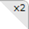</td>
				<td class="value"></td>
			</tr>
			<tr>
				<td class="description">Cluster&nbsp;Member Count</td>
				<td class="description">Number of individual accounts that make up the cluster. Not displayed for accounts.</td>
				<td class="description">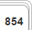</td>
				<td class="value"></td>
			</tr>
		</tbody>
	</table>

###  Transaction History Chart ###

The Transaction History chart on each card provides an aggregated view of the account's activity over the selected Transaction Flow Period (represented by the x-axis). Transactions flowing into the account are shown above the x-axis, while transactions flowing out are below.

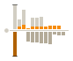

Depending on the selected Transaction Flow Period, each bar in the chart represents an aggregation of all transactions that occurred over a different timescale:

	<table class="summaryTable">
		<thead>
			<tr>
				<th scope="col">Interval</th>
				<th scope="col">Each Bar Represents</th>
			</tr>
		</thead>
		<tbody>
			<tr>
				<td class="value">2 weeks</td>
				<td class="description">1 day</td>
			</tr>
			<tr>
				<td class="value">16 weeks</td>
				<td class="description">1 week</td>
			</tr>
			<tr>
				<td class="value">1 year</td>
				<td class="description">1 month</td>
			</tr>
			<tr>
				<td class="value">16 months</td>
				<td class="description">1 month</td>
			</tr>
			<tr>
				<td class="value">4 years</td>
				<td class="description">1 quarter of a year</td>
			</tr>
			<tr>
				<td class="value">16 years</td>
				<td class="description">1 year</td>
			</tr>
		</tbody>
	</table>

The values of any transactions with the [highlighted](#highlighted) account are called out in orange. All other transactions are represented in grayscale.

#### Scale ####

For new workspaces, Transaction History charts are scaled relative to a default value that is configurable for each deployment. In the generic financial application, this value is set as $1,000. Once you [highlight](#highlighted) an account in the workspace, the default value is overridden and all transaction charts are scaled relative to the greatest value in the transaction history of the highlighted account.

In either case, aggregated transaction values that are larger than the scale are shown as clipped bars with a black line above or below them to indicate they are not to scale.

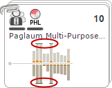

#### Expanded View ####

An expanded version of each account's transaction history chart is accessible in the [Details pane](../interface/#details-pane). The scale of this chart is always relative to the account's own transaction history.

##  Investigating Entities ##

Once you have identified accounts that you want to investigate, you can use the Flow workspace to interactively expand their transaction flow to understand behavioural patterns.

### Reviewing Account Attributes ###

<h6 class="procedure">To review the key attributes of an account</h6>

1. Review the [summary icons](#summary-attributes) on the account card or cluster stack.
2. Mouse over any icon to view a tooltip describing the attribute it represents.

<h6 class="procedure">To review a complete list of account attributes</h6>

1. Click the account to open the [Details pane](../interface/#details-pane).
2. Scroll through the left panel to review the Account Details (for accounts) or Cluster Member Summary (for clusters).

<strong>NOTE</strong>: The border of the selected card or stack in the Flow workspace is now blue.

### Reviewing Transaction History ###

<h6 class="procedure">To visualize the transaction history of an account</h6>

1. Review the [Transaction History chart](#transaction-history) on the card or stack, which provides a quick view of the account's history over the specified Transaction Flow period.
2. For an expanded view of the same chart, click the account to open the Details pane.
3. On the right panel, select the Transaction Chart tab to view an expanded and labeled version of the Transaction History chart.
4. Mouse over any bar in the chart for an overview of the date ranges it covers and the total inflowing or outgoing value it represents.

<h6 class="procedure">To review a list of the transactions an account has made</h6>

1. Click the account to open the [Details pane](../interface/#details-pane).
2. On the right panel, select the Transaction Table tab to view a paginated list of the transactions in which the account was involved. Transactions that involve the account that is currently [highlighted](#highlighted) are listed in orange. 

<strong>NOTE</strong>: The Transaction Table tab is not available for clusters.

##  Branching Transaction Flow ##

To help you investigate the flow of transactions, Influent allows you to interactively branch out the entities with which an account has participated in an a transaction. This enables you to create visualizations of your data that contain only the entities relevant to a specific line of investigation.

The directionality of branching in the Flow workspace is semantically meaningful. Entities on the left side of the workspace send transactions to entities on the right. This allows you to follow the money or communication trail between entities.

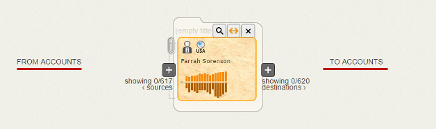

Depending on your dataset, you may see instances where a single entity appears both in the left and right branches of another entity. Understanding the expected transactional patterns in your data source is the key to using Influent to find accounts of interest.

### Branching off of an Entity ###

<h6 class="procedure">To branch off an entity</h6>

1. Mouse over the account or cluster to reveal its **Branch** buttons.
2. Review the number under each **Branch** button to see the total source and destination entities to which the account or cluster is connected. Any connected entities already shown in the workspace will also be indicated.
3. Click the left **Branch** button to view transactions flowing into the account.
4. Click the right **Branch** button to view the transactions flowing out of the account.

#### Limitations ####

- Influent displays warnings when you try to branch off an account with connections to more than 1,000 accounts on the incoming or outgoing side, as the process of computing clusters and refreshing the workspace for a large group of accounts can be time consuming. For the same reason, Influent will not allow branching off of accounts with more than 10,000 incoming or outgoing connections. Both of these limits can be configured for each Influent deployment.
- You cannot create branches directly from accounts in your [pattern search](../../advanced/pattern-search) results. You can only branch from accounts saved in files or from accounts branched off of accounts saved in files.

###  Understanding Transaction Flow Lines ###

Lines between accounts and clusters in the Flow workspace indicate the value of the transaction between the entities. The thicker the lines, the greater the value.

	<table class="summaryTable">
		<thead>
			<tr>
				<th scope="col">Line Type</th>
				<th scope="col">Description</th>
			</tr>
		</thead>
		<tbody>
			<tr>
				<td class="property">
					Transactions
					 
					
				</td>
				<td class="description">Appear between accounts or clusters that have been involved in a transaction. The account/cluster on the left side of the line sent a transaction to the account/cluster on the right side.
				
Indicates that neither account in the transaction is the highlighted focal point of the workspace.
				</td>
			</tr>
			<tr>
				<td class="property">
				Highlighted Transactions
				 
				
				</td>
				<td class="description">Appear between the account or cluster that is currently highlighted and all of the other entities in its transaction flow.</td>
			</tr>
			<tr>
				<td class="property">
					Asserted Relationships
					 
					
				</td>
				<td class="description">Appear between files in the workspace. Indicates a user-asserted relationship between the accounts/clusters stored in the files.</td>
			</tr>
			<tr>
				<td class="property">
					Highlighted Asserted Relationships
					 
					
				</td>
				<td class="description">Appear between files in the workspace. Indicates one of the accounts or clusters in the user-asserted relationship is the highlighted focal point of the workspace.</td>
			</tr>
		</tbody>
	</table>

### Highlighting an Account's Transactions ###

Influent allows you to apply focus to the workspace by highlighting transactions involving a specific entity. When you highlight an entity:

- All direct transactions with the highlighted account are shown in orange. Unrelated and indirect transactions are displayed in grayscale. 
- All other Activity History charts in the workspace are scaled in proportion to the transaction values on the highlighted card.

<h6 class="procedure">To make a card the main focal point of the Flow workspace</h6>

- Mouse over the card and click the **Highlight Flow**  button.

##  Managing Entities ###

After you have expanded the transaction flow of the accounts you are investigating, you may want to manage the newly added entities to organize the workspace, save additional accounts of interest for future use and remove any irrelevant entities.

###  Moving Accounts ###

The following sections describe how to move accounts to [files](#files), which are used to distinguish accounts of interest and manage the workspace.

<h6 class="procedure">To move a pattern search result to an existing file</h6>

- Mouse over the card and click the **Add to File**  button to add the account to the file under which the results were returned. 

<strong>NOTE</strong>: You can also click and drag account cards to manually move them to or between files.

<h6 class="procedure">To move an account to a new file</h6>

- Mouse over an account in the workspace that has been [branched](#branching) off of a filed card and click the **Move to New File**  button.

Influent creates a new file with the same name as the selected card and adds the card to it.

<h6 class="procedure">Removing an Account from the Workspace</h6>

- To remove an account from the workspace, mouse over the card and click the **Remove**  button.

Influent removes the card from the workspace, file or search results.

<h6 class="procedure">To expand or collapse a cluster</h6>

- Click the paper clip icon on the left side of the stack:
	- **Unstack** : Indicates that you can expand the member accounts and sub-clusters that make up the stack.
	- **Restack** : Indicates that you can collapse the member accounts and sub-clusters that make up the stack.

## Next Steps

For information on importing or exporting your data to/from Influent, see the [Importing and Exporting](../import-export) topic.