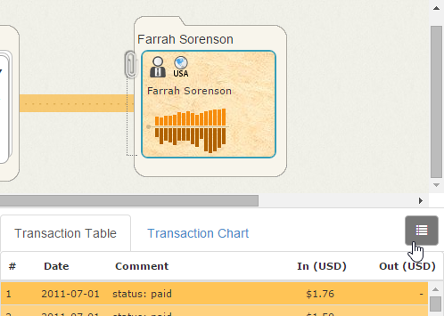
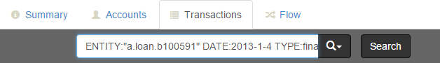
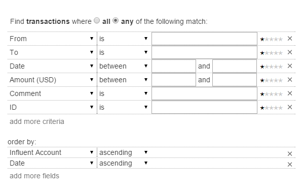
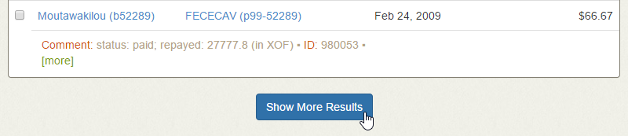
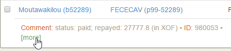

Searching for Transactions
==========================

This topic describes how to use the Transactions tab to:

- Investigate the transactions made by previously identified accounts of interest
- Search for accounts based on known transaction information

##  Investigating Transactions for Accounts of Interest ##

If you have already used the Accounts or Flow tabs to identify the accounts that you want to investigate, you can quickly view them on the Transaction tab to see a sorted list of the transactions in which they participated.

<h6 class="procedure">To access the transactions list from the Accounts tab</h6>

1. Select the checkboxes for the accounts that you want to investigate.
2. Click the **View transactions for selected accounts** button.

<h6 class="procedure">To access the transactions list from the Flow tab</h6>

1. Click the card or stack that you want to investigate to open the [Details pane](../interface/#details-pane).
2. Review the Transaction Table, which lists the transactions involving the selected entity over the specified Transaction Flow Period. 
<strong>NOTE</strong>: This view of the transactions omits the source and destination entity information.

3. To view the source and destination entities, click the **View Transactions** button.
4. Alternatively, click a single row in the Transaction Table to view only that transaction on the Transactions tab.

##  Performing Searches ##

You can also use the Transactions tab to identify accounts of interest by searching for the details of known transactions. It supports both simple string searches and more advanced searches with:

- Multiple transaction details criteria
- *Any*/*all* logic to control the breadth of results
- Non-exact fuzzy matching to correct for typos and return results similar to what you entered
- Weighted criteria to indicate which details are most important

###  Simple Searches ###

<h6 class="procedure">To execute a simple string search</h6>

<ol>
	<li>Enter any of the following (case sensitive) field labels into the Transactions search bar:
		

			<table class="summaryTable">
				<thead>
					<tr>
						<th scope="col">Identifier</th>
						<th scope="col">Finds</th>
						<th scope="col">Example</th>
					</tr>
				</thead>
				<tbody>
					<tr>
						<td class="property">FROM</td>
						<td class="description">Transactions in which the specified account ID was the sender</td>
						<td class="value">FROM:"a.account.397635298"</td>
					</tr>
					
					<tr>
						<td class="property">TO</td>
						<td class="description">Transactions in which the specified account ID was the recipient</td>
						<td class="value">TO:"a.account.397635298"</td>
					</tr>

					<tr>
						<td class="property">DATE</td>
						<td class="description">Transactions on a specific date or during a specific timespan</td>
						<td class="value">
							<ul>
								<li>DATE:2013-1-2</li>
								<li>DATE:[2013-1-1 TO 2013-1-3]</li>
								<li>DATE:[2013-1-1 TO *]</li>
								<li>DATE:[* TO 2013-1-3]</li>
							</ul>
						</td>
					</tr>

					<tr>
						<td class="property">AMOUNT</td>
						<td class="description">Transactions of a specific value</td>
						<td class="value">
							<ul>
								<li>AMOUNT:100</li>
								<li>AMOUNT:[100 TO 500]</li>
								<li>AMOUNT:[100 TO *]</li>
								<li>AMOUNT:[* TO 500]</li>
							</ul>
						</td>
					</tr>

					<tr>
						<td class="property">ENTITY</td>
						<td class="description">Transactions in which the specified account ID was either the recipient or the sender</td>
						<td class="value">ENTITY:"a.account.397635298"</td>
					</tr>

					<tr>
						<td class="property">LINKED</td>
						<td class="description">Transactions in the account ID was opposite ENTITY in the transaction. Use in conjunction with ENTITY.</td>
						<td class="value">ENTITY:"a.account.397635298" LINKED:"a.account.533869146"</td>
					</tr>
				</tbody>
			</table>
		

	</li>
	<li>If you entered multiple search terms, you can add the <strong>MATCH:</strong> property to specify whether you want to receive results that match <em>any</em> or <em>all</em> of your terms (e.g., <em>MATCH:any</em>).</li>
	<li>Click <strong>Search</strong>.</li>
</ol>

###  Advanced Searches ###

<h6 class="procedure">To execute an advanced search using other transaction details</h6>

<ol>	
	<li>Click the <strong>Advanced Search</strong>  button.</li>
	<li>Determine whether you want Influent to return only results that match <strong>All</strong> of your search criteria or results that match <strong>Any</strong> subset of your criteria.</li>
	<li>Configure your search criteria:
		<ol type="a">
			<li>Choose an attribute from the <strong>Criteria</strong> drop-down list.</li>
			<li>Select one of the following options from the <strong>Match</strong> drop-down list to configure non-exact fuzzy matching:
				

					<table class="summaryTable">
						<thead>
							<tr>
								<th scope="col">Field Type</th>
								<th scope="col">Match Type</th>
								<th scope="col">Return Results That</th>
							</tr>
						</thead>
						<tbody>
							<tr>
								<td class="description" rowspan="5">String</td>
								<td class="value">Is</td>
								<td class="description">Match or contain the search terms</td>
							</tr>
							
							<tr>
								<td class="value">Is&nbsp;very&nbsp;like</td>
								<td class="description">Are <em>highly</em> similar to the search terms</td>
							</tr>
							
							<tr>
								<td class="value">Is&nbsp;like</td>
								<td class="description">Are similar to the search terms</td>
							</tr>
							
							<tr>
								<td class="value">Is&nbsp;vaguely&nbsp;like</td>
								<td class="description">Are <em>vaguely</em> similar to the search terms.</td>
							</tr>
							
							<tr>
								<td class="value">Is&nbsp;NOT</td>
								<td class="description"><em>Do not</em> match or contain the search terms</td>
							</tr>
							<tr>
								<td class="description" rowspan="5">Numeric</td>
								<td class="value">Between</td>
								<td class="description">Fall between two search terms</td>
							</tr>
							
							<tr>
								<td class="value">Is</td>
								<td class="description">Match the search terms</td>
							</tr>
							
							<tr>
								<td class="value">Greater than</td>
								<td class="description">Are greater than the search terms</td>
							</tr>
							
							<tr>
								<td class="value">Less than</td>
								<td class="description">Are less than the search terms</td>
							</tr>
						</tbody>
					</table>
				

			</li>
			<li>In the text box, enter the terms or values for which you want to search.</li>
			<li>If necessary, use the starts to indicate the relative importance of your criteria. More stars mean a term is more important.
Weighted criteria are most useful when your search terms are uncertain (i.e., you are searching for results that match or are <em>like</em> any one of your criteria).
</li>
			<li>If necessary, click <strong>Add More Criteria</strong> to include additional details in your search. Repeat the previous four steps for each criteria you add.</li>
		</ol>
	</li>
	<li>Configure how you want your results to be ordered:
		<ol type="a">
			<li>Use the <strong>order by</strong> drop-down list to choose an attribute by which to group results.</li>
			<li>Select <em>ascending</em> or <em>descending</em> from the <strong>Order</strong> drop-down list to choice how result groupings are displayed.</li>
			<li>If necessary, click <strong>Add More Fields</strong> to include additional order by rules.</li>
		</ol>
	</li>
	<li>Click <strong>Search</strong>.</li>
</ol>

##  Navigating Search Results ##

By default, the Transactions tab retrieves a list of the top 50 results for the search terms that you entered. Initially, only 12 results are displayed. You can expand the list at any time to view more of the top results.

The Transactions tab operations bar lists the total number of accounts that match your search criteria; if this number larger than 50, it may be helpful to narrow your search by entering additional criteria in the Advanced Search dialog.

Results are grouped by a configurable transaction detail, such as the unique IDs of the participating entities and the date on which they occurred.

### Loading Results ###

<h6 class="procedure">To view more top results</h6>

1. Scroll to the bottom of the results list and click the **Show More Results** button to display 12 more results.
2. Repeat step 1 as necessary until you reach the results limit.

### Reviewing Results ###

Individual results are listed in an abbreviated format to show the key transaction details:

- Names and unique IDs of the participating entities
- Date on which the transaction occurred
- Transaction value

<h6 class="procedure">To view more details about an individual result</h6>

Click the **more** button  in the transaction overview.

### Selecting Results for Further Investigation ###

Any search result can be viewed on the Accounts or Flow tabs for further investigation of the participating entities.

<h6 class="procedure">To view summaries of the accounts that participated in a transaction</h6>

1. Select the checkbox next to the results you want to investigate.
2. Click the **View accounts for selected transactions** button.

<h6 class="procedure">To interact with a visualization of accounts that participated in a transaction</h6>

1. Select the checkbox next to the results you want to investigate.
2. Click the **View selected accounts in Flow View** button.

## Next Steps

For information on visually interacting with entities and their transaction flow, see the [Investigating Transaction Flow](../investigate-flow) topic.