Getting Started
===============

This topic presents an example Influent workflow to help new users quickly understand the application. This example is based on publicly available Kiva transaction data. You can follow along by:

- Downloading and installing the [standalone demo](../../../community/download/#packaged-distribution). 
- Accessing the [live demo](../../../demos/#kiva) on this website. This demo uses a larger Kiva dataset, so you may notice differences in the number of accounts and transactions in your search results and branching operations.

**NOTE**: While this example uses publicly available Kiva data, the individual names in the scenario have been anonymized.

##  Analytic Scenario ##

A tip identifies a lender in the United States, *Hugh Carrillo*, who may have indirectly participated in a transaction with an account exhibiting suspicious behavior. In this scenario, you want to find:

- When the account was active
- What transactions the account participated in and with whom
- What other transactions in your dataset are similar to the pattern exhibited by *Hugh Carrillo*

Influent enables you to answer all of these questions by allowing you to: 

- Explore the transaction flow of the account of interest
- Search for unusual patterns of activity related to what you find

##  1. Logging In ##

Influent is accessible from any modern Web browser (i.e., Chrome, Firefox, Safari or Internet Explorer).

<h6 class="procedure">To start a new session</h6>

1. Open your browser and navigate to the location of your Influent Web server:
	- For the [standalone demo](../../../community/download/#packaged-distribution): Typically <http://localhost:8080/kiva/>
	- For the live demo: <http://influent.org/kiva/>
2. Review the Summary tab, which describes the nature and scope of your dataset.

##  2. Finding Accounts of Interest ##

###  Searching for Accounts ###

To begin your investigation, access the Accounts tab, which lets you search for entities based on known identifying attributes.

<h6 class="procedure">To access the Accounts tab</h6>

- Click the **Search Accounts** button on the Summary tab.

<h6 class="procedure">To search for an account</h6>

One way to get started would be to search for the name of the lender account. However, you know the account is U.S.-based, so you can use the Advanced Search to filter out accounts with similar names in other countries.

1. Click the **Advanced**  button in the Accounts search bar.
2. Select *Lender* from the **Find** drop-down list to specify the account type.
3. Enter *hugh carrillo* in the **Name** field.
4. Enter *US* in the **Country code** field.
5. Select the **all** radio button to specify that you only want results that match both criteria.
6. Click **Search**.

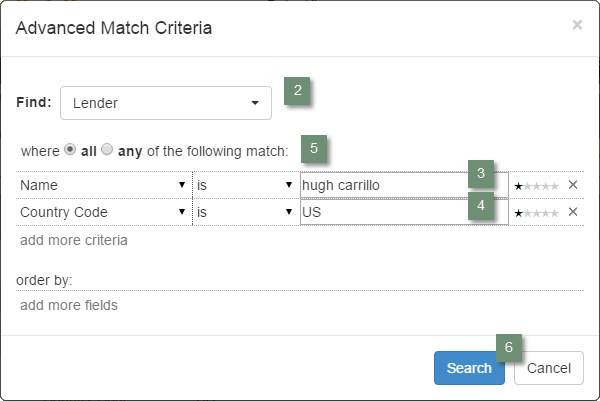

#### Reviewing Accounts Search Results ####

Influent displays a summary of the only account that matches all your search criteria: *Hugh Carrillo*.

 

<h6 class="procedure">To review the account's details</h6> 

- Click the **more** link in the result to reveal account attributes that partially address the analytic scenario questions:
	- **When was the account active?**
		<ol type="a">
			<li>Scroll to the <strong>Earliest Transaction</strong> (<em>Oct 9, 2009</em>) and <strong>Latest Transaction</strong> (<em>Dec 30, 2012</em>) attributes.</li>
			<li>Review the <strong>Transaction Activity</strong> chart, which illustrates the history of aggregate funds coming into (above the x-axis) and going out (below) of the account.</li>
		</ol>
	- **With whom did the account participate in transactions?**
		<ol type="a">
			<li>Scroll to the <strong>Inbound Sources</strong> (<em>1</em>) and <strong>Outbound Targets</strong> (<em>2</em>) attributes to see how many other accounts connect with *Hugh Carrillo*.</li>
		</ol>
	- **How much money was involved?**
		<ol type="a">
			<li>Review the <strong>Average Transaction</strong> (<em>$6.55</em>) and <strong>Largest Transaction</strong> (<em>$47</em>) attributes.</li>
			<li>Hover your mouse over the bars in the <strong>Transaction Activity</strong> chart to see the aggregate inflowing and outflowing values in each month.</li>
		</ol>

While you now know generally when and how much money was sent to/from *Hugh Carrillo*, the Accounts tab does not identify the other transaction participants.

To investigate the *Hugh Carrillo* transactions, you need to view the account's activity on the Transactions tab.

##  3. Reviewing Detailed Transactions ##

When you choose to view the activity of an account on the Transactions tab, Influent searches for all transactions involving the account ID. Results are grouped by the identifies of the participating entities, then by date.

### Viewing Results from the Accounts Tab on the Transactions Tab ###

You can quickly view the *Hugh Carrillo* account's activity on the Transactions tab for further investigation.

<h6 class="procedure">To view the account on the Transactions tab</h6>

1. Select the checkbox to the left of *Hugh Carrillo*.
2. Click the **View transactions for selected accounts** button.

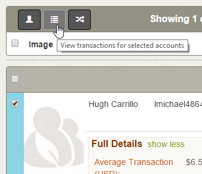

### Reviewing Individual Transactions ###

The Transaction tab lists the transactions in which *Hugh Carrillo* has participated. Because you do not know which of the account's activities to start with, you might choose to focus on its largest transaction first. 

<h6 class="procedure">To find an account's largest transaction</h6>

1. Click the **Amount (USD)** column above the transaction results to sort transactions in descending order of value.
2. Notice that the largest transaction was *$47* on *Oct 9, 2009*, which *Hugh Carrillo* sent to *Microfund Togo*, a partner (broker) account.

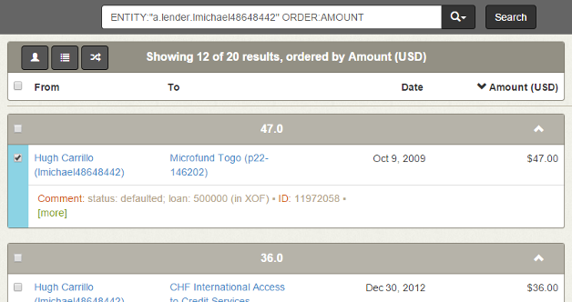

##  4. Exploring Transaction Flow ##

Now that you have two accounts you want to explore, you can view them on the Flow tab to visualize and interactively expand their transaction histories.

### Viewing Results from the Transaction Tab on the Flow Tab ###

The Flow tab is a workspace to branch off accounts of interest and reveal accounts for which you previously had no information.

<h6 class="procedure">To view accounts on the Flow tab</h6>

1. Select the checkbox to the left of *Hugh Carrillo's* largest transaction.
<strong>NOTE</strong>: Transaction directionality is important; Influent adds entities to the Flow tab with the **From** account on the left and the **To** account on the right.

2. Click the **View selected accounts in Flow View** button.

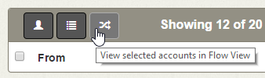

	Both accounts appear in the Flow workspace, with:
	<ul>
		<li><em>Hugh Carrillo</em> (the <strong>From</strong> account) filed in a column on the left</li>
		<li><em>Microfund Togo</em> (the <strong>To</strong> account) filed in a column on the right</li>
	</ul>

### Managing the Flow Workspace ###

<h6 class="procedure">To understand the account representations in the Flow workspace</h6>

1. Hover your mouse over the icons on the cards in the workspace to see basic attributes of the corresponding account such as: 
	- **Type** (*lender*, *partner* or *loan*)
	- **Location** (*continent* and *country*)
	- **Status** (e.g., *closed* or *defaulted*)
2. Notice the background of the cards, which indicates the certainty of the transaction information of the accounts they represent:
	- **White** indicates complete certainty
	- **Manila** indicates some uncertainty
3. Review the Transaction Activity charts on the cards for expected patterns. Like the chart on the Accounts tab, this chart shows aggregate inflowing and outflowing transactions above and below the x-axis, respectively.
Accounts participating in microloans should have roughly equal values above and below the axis, with some offsets for interest incurred, fund transfer delays and payment installments.

#### Transaction Flow Period ####

Notice that the *Hugh Carrillo* card chart only shows inflowing transactions. This can indicate that the time frame currently displayed in the workspace (the Transaction Flow Period) is incomplete.

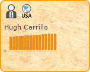

<h6 class="procedure">To change the Transaction Flow Period</h6>

1. Set the **Start Date** to the first day on which *Hugh Carrillo* made a transaction, *Oct&nbsp;9,&nbsp;2009*.
2. Set the **End Date** to last day on which *Hugh Carrillo* made a transaction, *Dec&nbsp;30,&nbsp;2012*. 
3. Influent suggests matching time windows for you to look at. Select the 4-year window from *Jan&nbsp;1,&nbsp;2009 to Jan&nbsp;1,&nbsp;2013*.

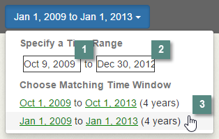

The card charts are refreshed to summarize the inflowing and outflowing activity over the specified Transaction Flow Period.

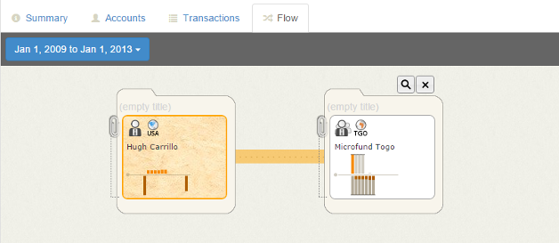

#### Highlighting Transaction Flow ####

The Flow workspace can be configured to highlight all transactions made with a specific account. Highlighted transactions appear in color on account activity charts and in the transaction flow lines that connect accounts.

Note that Influent automatically highlighted *Hugh Carrillo* (the **From** account). The *Microfund Togo* card chart has both color and grayscale portions. The color indicates money received from or sent to *Hugh Carrillo*.

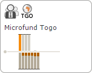

### Branching to Reveal Connected Accounts ###

The iterative branching capabilities of the Flow workspace allow you to identify unknown accounts connected to *Hugh Carrillo* or *Microfund Togo*.

<h6 class="procedure">To view all the accounts that have received transactions from Microfund Togo</h6>

1. Hover over the *Microfund Togo* card to show its **Branch** buttons. Click the right **Branch** button to see accounts that received transactions from *Microfund Togo*.
2. Notice the two groups of entities that received money from *Microfund Togo*: a single *Anonymous* loan (borrower) account and a cluster of 24 lender accounts.
3. Click the paperclip over the cluster of lender accounts to view the child accounts and clusters it contains.
If you expand all the child clusters, you will find <em>Hugh Carrillo</em> again, which indicates that <em>Microfund Togo</em> repaid him for his original loan.

4. Notice that the bars in the *Anonymous* activity chart are all capped with black lines. 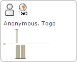
This indicates that the transactions are larger than the largest transaction made by the currently highlighted account.

5. Hover your mouse over the *Anonymous* account and click the **Highlight Flow**  button to refresh the workspace to its scale.
6. Notice that the account activity for *Anonymous* appears to have much more value above the x-axis (money coming in) than below it (going out). 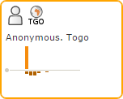
This may indicate suspicious or fraudulent behavior.

From here, you can explore the transaction flow of the *Anonymous* account for suspicious behavior.

##  5. Recognizing Anomalous Patterns ##

Understanding expected transaction patterns in your source data is key to using Influent to recognize suspicious behavior.

With the Kiva example, you should expect to see roughly symmetrical transactions for all accounts. Therefore, a given account should have:

- The same accounts on both sides (sources and destinations) of its transaction flow
- Roughly equivalent values coming into and going out of the account, which means:
	- The transaction flow lines on both sides of the account should be similar in size
	- The total values above and below the axis in the activity chart should be similar

Absence of any of these features may indicate suspicious behavior.

### Sources and Destinations ###

For loan transaction data, the number of sources and destinations to which an account is connected can reveal whether the loan was repaid. A partner or borrower with no destinations can indicate that the account never delivered or repaid the funds it received.

<h6 class="procedure">To view how many source and destinations an account has</h6>

1. Hover your mouse over the *Anonymous* account to reveal the **Branch** buttons. 
2. Notice that the summary below the right **Branch** button indicates *Anonymous* has *1* destination, meaning it did repay at least part of its loan.

### Transaction Flow Lines ###

Disparities in the transaction flow lines between accounts may indicate suspicious behavior. In a loan, the thickness of the lines on both sides of an account should be roughly the same.

Make sure your [Transaction Flow Period](#transaction-flow-period) covers the entire time over which transactions were made between the accounts in question. Otherwise, fund transfer delays may suggest false positives.

<h6 class="procedure">To compare incoming and outgoing transaction flow lines</h6>

1. Branch to right of the *Anonymous* account to reveal its destination: *Microfund Togo*, the same partner account that initiated the loan.
2. Notice that the outgoing line to *Microfund Togo* is much thinner than the incoming line. It is clear that *Anonymous* did not repay its full loan amount.

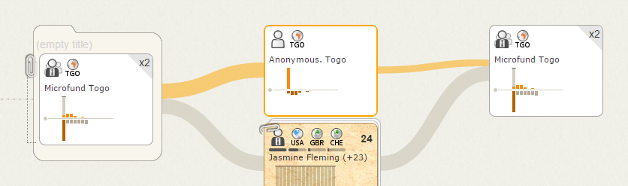

### Account Activity Charts ###

The [activity charts](../concepts/#account-cards) on account cards in the Flow workspace can also show disparities between incoming and outgoing funds. Features such as the size and frequency of transactions may indicate suspicious activity.

	<table class="summaryTable">
		<thead>
			<tr>
				<th scope="col">Type</th>
				<th scope="col">Transaction Flow</th>
				<th scope="col">Expected Pattern</th>
			</tr>
		</thead>
		<tbody>
			<tr>
				<td class="description">Lenders</td>
				<td class="description">
					<ol style="margin-top: 0px;">
						<li>Give money to a partner.</li>
						<li>Receive the same amount back (in installments) from the partner once the borrower begins repaying the loan.</li>
					</ol>
				</td>
				<td class="description">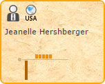</td>
			</tr>
			<tr>
				<td class="description">Partners</td>
				<td class="description">
					<ol style="margin-top: 0px;">
						<li>Receive small amounts of money from multiple lenders at the same time.</li>
						<li>Loan the aggregated value to a borrower.</li>
						<li>Receive repayments (including interest incurred) from the borrower in installments.</li>
						<li>Repay lenders in installments (but without interest).</li>
					</ol>
				</td>
				<td class="description">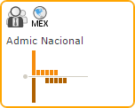</td>
			</tr>
			<tr>
				<td class="description">Loans</td>
				<td class="description">
					<ol style="margin-top: 0px;">
						<li>Receive a loan from a partner.</li>
						<li>Repay the loan to the partner in installments (including interest incurred).</li>
					</ol>
				</td>
				<td class="description">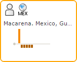</td>
			</tr>
		</tbody>
	</table>

If you cannot gauge from the card chart whether the incoming and outgoing transaction values are similar, you can open the Details Pane for an expanded view.

<h6 class="procedure">To open the Details Pane for an account</h6>

1. Click on the *Anonymous* account card.
2. View the Transaction Table for a detailed list of incoming and outgoing transactions and their values.
3. Use the **Export** button to save the detailed transaction list to a CSV file that you can use to calculate the balance of the account.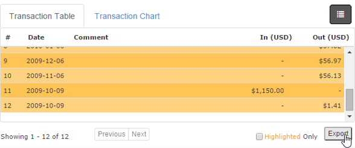
4. Click the **Transaction Chart** tab to view an expanded account activity chart, where it is easier to see that the outgoing transactions do not equal the incoming transaction.

##  6. Searching for Similar Transaction Patterns ##

With *Anonymous* identified as an account of interest, you can perform a [Pattern Search](../activity-search) to find previously unknown accounts with similar transaction pattern histories. When looking for similar transaction patterns, Influent considers two types of features:

1. **Individual account activity features**, which describe the behavior of an account's interactions (e.g., averages, distributions and frequency).
2. **Transactional features**, which describe how transactions between accounts compare to the whole dataset and to the subset within the selected Transaction Flow Period.

<h6 class="procedure">To perform a pattern search</h6>

1. File the *Anonymous* account by hovering your mouse over it and clicking the **Move to New File**  button.
The pattern search functionality only works on filed accounts. Unfiled accounts in the workspace are ignored.

2. Select **Find Patterns Like This** from the **Workspace** menu.

Cards representing each of the accounts that are similar to those in your workspace are listed below each file.

<h6 class="procedure">To explore pattern search results</h6>

- Hover over a card and click the  button. 
<strong>NOTE</strong>: You cannot branch off search results until they are filed.

##  7. Exporting Transaction Flow Data ##

Influent enables you to export your Flow workspace data in a number of different ways:

<h6 class="procedure">To export your filed workspace data to an XML file</h6>

- Select **Export Chart** from the **File** menu.

Influent XML files (*.infml) can be saved for importing into later Influent sessions or shared with other analysts. <strong>NOTE</strong>: Search results and other unfiled accounts cannot be saved to XML files.

<h6 class="procedure">To export a screenshot of your workspace as an image</h6>

- Select **Export Image** from the **File** menu.

Workspace images (*.png) can be easily included in reports or emailed to individuals without access to Influent. The exported image shows the selected Transaction Flow period and the entire workspace, including unfiled accounts and search results.

## Next Steps ##

For detailed descriptions of the account and workspace concepts in the Influent workspace, see the [Understanding Influent Concepts](../concepts) topic.