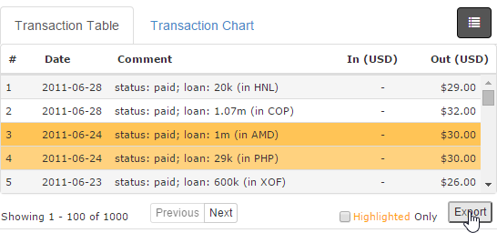
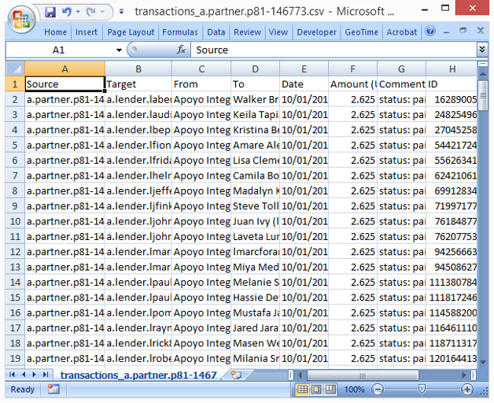

Importing and Exporting Data
============================

Influent enables you to import and export transaction flow data from the Flow tab in order to:

- Save transaction flow data across multiple Influent sessions
- Share transaction flow data with other analysts that use Influent
- Share transaction flow data with individuals who do not have access to Influent

## File Formats ##

Influent supports the following file formats:

- **Influent Files (XML)**: Save and work with files, folders and transaction flow information across multiple sessions. 
<strong>NOTE</strong>: Influent XML files (*.infml) do not contain activity search results or other unfiled accounts loaded in the workspace.

- **Workspace Images (PNG)**: Save a complete screenshot of the Flow workspace as an image that can be easily included in reports or emailed to individuals without access to Influent.
- **Detailed Transaction History (CSV)**: Save detailed transaction history data for an individual account to a comma-separated values (CSV) file that can be opened or imported into your spreadsheet or database program of choice.

## Importing Influent Project Data ##

You can use Influent's import functionality to open project data that was saved from a previous session or shared with you by another analyst. Only Influent XML files (\*.infml) are supported for import.

**NOTE**: The import process will overwrite any information you have in your current workspace. It is recommended that you export any data you don't want to lose before proceeding with an import.

<h6 class="procedure">To import previously saved Influent project data</h6>

1. Select **Import Chart** from the **Workspace** menu.
2. Browse to the location of the Influent XML file (\*.infml) you want to import and click **Open**.

Your Influent workspace is refreshed to show the filed accounts, relational transaction flow data and workspace focus contained in the XML file.

## Exporting Influent Project Data ##

You can use Influent's export functionality to save and share transaction flow data you have loaded in your Flow workspace.

### Exporting Influent Files ###

Influent files are XML-formatted and contain all of the filed accounts in your workspace. They also retain the relational links between those accounts and the focus of your workspace (highlighted and selected accounts) at the time of export.

<h6 class="procedure">To export an Influent XML file</h6>

1. Make sure that all of the accounts you want to save are filed in the workspace. Unfiled accounts and activity search results will not be saved to the XML file.
2. Select **Export Chart** from the **File** menu.
3. The XML is automatically saved to the download location specified in your Web browser (e.g., *C:\\Users\\jsmith\\Downloads*) as *influent-saved.infml*. We recommend you rename the file to indicate when it was generated and/or the nature of its contents.

### Exporting Transaction Flow Images ###

You can save your transaction flow data as an image that can be included in a report or shared with individuals without access to Influent. Exported images show:

- The entire Influent workspace (i.e., accounts in the workspace, in files and in the Activity Search Results)
- The header with the Transaction Flow period.

**NOTE**: Exported images do not include the Details pane for the selected account.

<h6 class="procedure">To export an image of the transaction flow data in your Flow workspace</h6>

1. Select **Export Image** from the **File** menu.
2. The PNG is automatically saved to the download location specified in your Web browser (e.g., *C:\\Users\\jsmith\\Downloads*) as *influent-snapshot.png*. We recommended you rename the file to indicate when it was generated and/or the nature of its contents.

### Exporting Detailed Transaction Information ###

The [Details Pane](../interface/#details-pane) lists the transactions made by the selected account. You can export this information to a CSV file that can be included in a report or shared with individuals without access to Influent.

<h6 class="procedure">To export a transaction list to a CSV file</h6>

1. Select the account for which you want to export the transaction data by clicking on it.
2. A blue border is drawn on the selected account and the Details Pane is displayed.
3. Click the **Export** button below the Transaction Table in the Details Pane.
	
<strong>NOTE</strong>: While you can filter the Transaction Table to display only transactions made with the highlighted account, your CSV export will still contain a complete list of the selected account's transactions.

4. The CSV is automatically saved to the download location specified in your Web browser (e.g., *C:\\Users\\jsmith\\Downloads*) as *transactions_{account ID}.csv*. We recommended you rename the file to indicate when it was generated and/or the nature of its contents.

