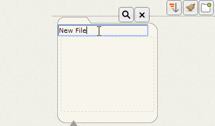
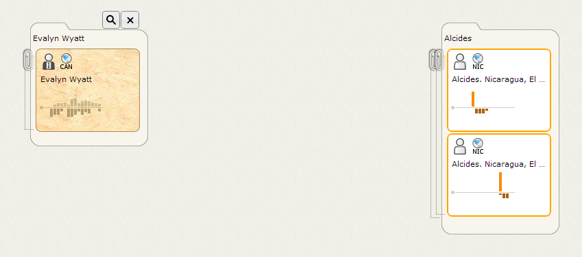

Getting Started
===============

This topic summarizes the basic Influent workflow, and is intended to help new users quickly understand the application and its functionality. For detailed information on the concepts and terminology used throughout the application and this help, see the [Concepts](concepts.md) topic. For detailed information on the Influent user interface, see the [Interface](interface.md) topic.

Workflow Example
----------------

The following Influent workflow example considers an analytic scenario starting with a tip about transfers from *Evalyn Wyatt* in *Canada* to *Alcides* in *Nicaragua*. Investigating this scenario with Influent consists of the following tasks:

1.  [Logging In](#logging-in)
2.  [Populating a New Workspace](#new-workspace)
3.  [Setting the Transaction Flow Period](#transaction-flow-period)
4.  [Searching for Accounts Using Identifying Attributes](#search-for-accounts)
5.  [Reviewing Account Details](#review-account-details)
6.  [Filing Search Results](#file-search-results)
7.  [Branching Transaction Flows](#branch-transactions)
8.  [Searching for Similar Transaction Patterns](#search-for-patterns)
9.  [Exporting Transaction Flow Data](#export-data)

Note that for the examples in this workflow, individual names have been anonymized.

### Logging In

Influent supports authentication of users through the integration of [Apache Shiro](http://shiro.apache.org/). If authentication is enabled in your deployment of Influent:

1.  Open your Web browser and navigate to the location of your Influent Web server.
2.  Enter the **Username** and **Password** supplied to you by your administrator, then click **Login**.
3.  Select the **Remember Me** check box to save your login information.

If authentication is not enabled, simply open your Web browser and navigate to the location of your Influent Web server.

### Populating a New Workspace

When you first log in to Influent, your [workspace](concepts.md#workspace) contains an empty file and a Search Panel. In this analytic scenario, you already know the names of the accounts you want to investigate based, so you can populate the workspace by creating files for each account:

1.  Rename the empty file in the workspace by double clicking *New File*, entering *Alcides* and pressing ENTER.
    
2.  Mouse over the empty column two spaces to the left of the *Alcides* file and click the **Add New File**  button to create a file. Rename the file *Evalyn Wyatt*. You will later use the empty column between *Alcides* and *Evalyn Wyatt* to find the common links between them.
    

Note that other analytic scenarios may necessitate a different approach to beginning an investigation with Influent. For example:

-   If you want to investigate accounts based on transaction flow data that was previously exported from another Influent session, you would import an Influent XML file (\*.infml). To import an XML file, select **Import Chart** from the **Workspace** menu and browse to the location of the file.
-   If you do not know the names of the accounts you want to find, you would search for accounts of interest based on other identifying attributes that might narrow down the group of accounts on which to focus

### Setting the Transaction Flow Period

By default, the Influent workspace illustrates transaction flow over a 16 month period. Exactly when this period starts and ends is configurable for each deployment. You can access these settings in the header at any time to narrow or expand your focus on transactions made to/from accounts of interest.

For this example:

1.  Change the **Transaction Flow** period to *4 years* to get a complete view of the activities of the accounts of interest.
2.  Set the **Start Date** to *Jul 1, 2009*. Notice that when you select the **Start Date**, the **End Date** is automatically updated.
3.  Click **Apply** to refresh the workspace.
    

### Searching for Accounts Using Identifying Attributes

When starting a new investigation, Influent's [Attribute Search](attribute-search.md) enables you to find accounts of interest by searching for identifying information such as name, occupation, location or status. Influent returns results as a paginated list of account cards in order of their overall weighted strength of match. Advanced search queries allow you to further expand your results by returning "fuzzy" matches that can account for spelling mistakes and identify similar names or terms.

To find the accounts for the actors in the analytic scenario:

1.  Click the **Advanced Search** button  on the Search Panel under the *Alcides* file to access the Advanced Search dialog. Locate Alcides by performing an [Advanced Attribute Search](attribute-search.md#advanced-search) for *loan* (borrower) accounts with the **Name** *Alcides* and the **Country code** *NI*. Click **Search** to load the results under the *Alcides* file.
    
2.  Now click the **Advanced Search** button  on the Search Panel under the *Evalyn Wyatt* file to access the Advanced Search dialog. Locate Evalyn by performing an [Advanced Attribute Search](attribute-search.md#advanced-search) for *lender* accounts with the **Name** *Evalyn Wyatt* and the **Country code** *CA*. Click **Search** to load the results under the *Evalyn Wyatt* file.

### Reviewing Account Details

To determine whether the search results contain the accounts for which you are looking, first review the icons on the cards in the search results. Notice that there is only one result for the Evalyn Wyatt search. The full name on the card matches your search terms exactly and the summary icons indicate that the account's location is CAN, the three-digit ISO country code for Canada. It is highly likely this is the account for which you are looking.

Now review the search results for Alcides, which contain 12 account cards. Notice that the loan (borrower) cards list a name and a location (country and municipality) for the accounts. The top three results are for accounts named Alcides in Nicaragua, but the municipalities are cut off. With this information alone, it is difficult to tell which and how many of the accounts belong to the Alcides in the analytic scenario.

Click each of the top three account cards to view a complete list of their attributes in the [Details Pane](interface.md#details-pane). For the selected card (displayed with a blue border in the workspace), this section of the user interface lists all of the identifying attributes (including images) for the corresponding account in your data source. It also contains tabs that list the complete transaction history of the account in both tabular and histogram formats. Note the similarities between the first and third search results:

-   Both accounts are located in the *El Sauce* municipality of Nicaragua
-   The loans associated with each account are classified in the *Health* **Sector**
-   The **Use** of the loans is specified as *Medical Expenses*
    

It is likely, given the similarities between the accounts, that these results belong to the Alcides specified in the analytic scenario.

### Filing Search Results

Now that you have located the accounts you want to investigate, you can [file](concepts.md#files) them. Filing accounts save them in the workspace and enables you to branch their incoming and outgoing transactions to follow the transaction history.

1.  File the two similar results for *Alcides* located in El Sauce, Nicaragua by mousing over each one and clicking its **Add to File**  button.
2.  Notice that when both cards are added to the file, Influent automatically creates a cluster containing each of the accounts. You can expand this cluster by clicking the **Unstack** button, which looks like a paperclip.
    
3.  File the only result for *Evalyn Wyatt* by mousing the card and clicking its **Add to File** button.
    

### Branching Transaction Flows

To view other accounts with which a filed account has participated in transactions, simply mouse over its card and click one of its **Branch** buttons. The **Branch** button to the left of the card fills the workspace with all accounts from which the account has received transactions, while the button on the right shows all accounts to which the account has sent transactions. The thickness of flow lines displayed between accounts that have executed a transaction indicates the value of the transaction. The thicker the line, the greater the transaction.

1.  Branch both to the left and right of *Alcides* to reveal a cluster of two CEPRODEL partner accounts on both sides, indicating that they have sent and received money from Alcides. Expand the clusters to view both member accounts.
2.  Notice that Evalyn Wyatt has sent money to CEPRODEL. This is the link between the two accounts of interest.
    
3.  Branch to the right of the CEPRODEL accounts to see if any other transaction patterns stand out.

It is recommended that you file any additional accounts of interest you uncover when branching transaction flows. Only filed accounts can be exported for use in other Influent sessions and or used to generate transaction pattern searches.

### Searching for Similar Transaction Patterns

Once you have identified and filed any number of accounts of interest, you can perform an [Activity Search](activity-search.md) to find accounts with similar transaction pattern histories. The power of Influent's activity search is its ability to return results for which you previously had no identifying characteristics.

There are two ways you can find accounts based on activity:

-   By searching for individual accounts that have similar patterns of initiating and receiving transactions. To find accounts similar to an individual example in your workspace:
    1.  Mouse over the card and click the **Search for Similar Accounts** button  to display the Advanced Match Criteria dialog.
    2.  Switch to the Match on Account Activity tab, then click **Search**.
-   By searching for a group of accounts that have transaction histories similar to the ones loaded in your workspace. To find accounts similar to a group of related accounts in your workspace:
    1.  Select **Find Patterns Like This** from the **Workspace** menu.
        

### Exporting Transaction Flow Data

Influent enables you to export your workspace transaction flow data in a number of different ways:

-   As an Influent XML file (\*.infml) that can be saved for importing into later Influent session or shared with other analysts. Select **Export Chart** from the **Workspace** menu to export all the files and accounts saved in those files in your workspace. Note that search results and other unfiled accounts will be not be saved to the XML file.
-   As an image (\*.png) that can be easily included in reports or emailed to individuals without access to Influent. The exported image shows the Influent header with the selected Transaction Flow period and all accounts in the workspace, including unfiled accounts and search results.

You can also export the transaction data for an individual account as a CSV file from the Transaction Table in the Details Pane.

